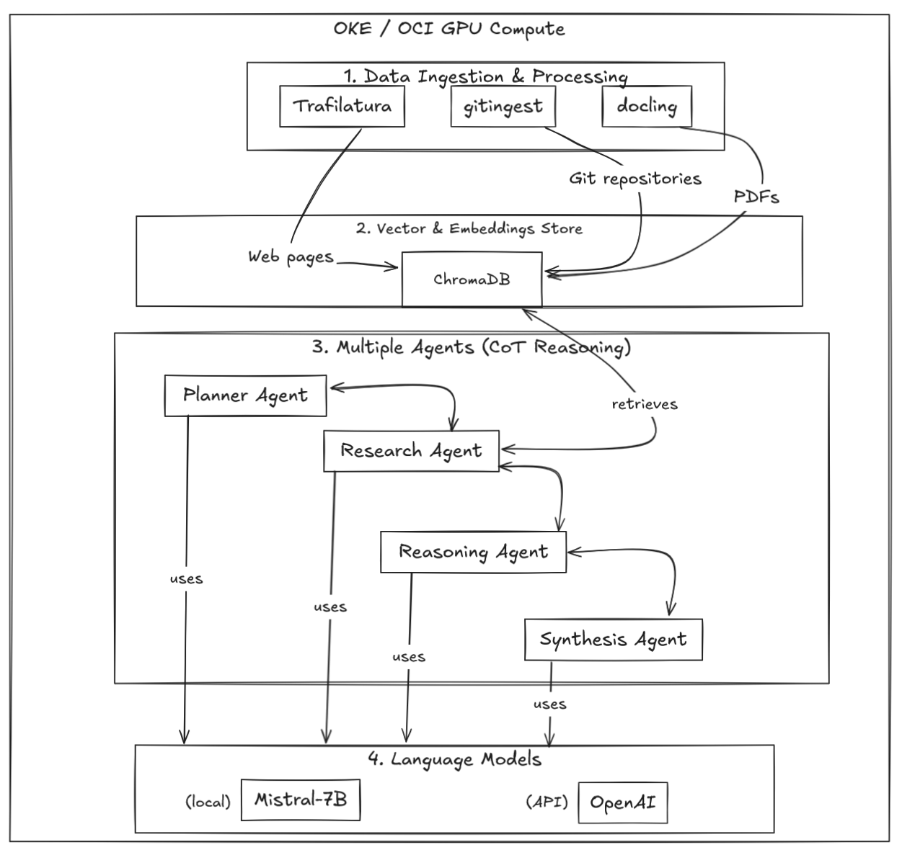

# Agentic RAG: Enterprise-Scale Multi-Agent AI System on Oracle Cloud Infrastructure

## Introduction

Agentic RAG is an advanced Retrieval-Augmented Generation system that employs a multi-agent architecture with Chain-of-Thought reasoning, designed for enterprise-scale deployment on Oracle Cloud Infrastructure (OCI). The system leverages specialized AI agents for complex document analysis and query processing, while taking advantage of OCI's managed Kubernetes service and security features for production-grade deployment.

With this article, we want to show you how you can get started  in a few steps to install and deploy this multi-agent RAG system using Oracle Kubernetes Engine (OKE) and OCI.



## Features

This Agentic RAG system is based on the following technologies:

- Oracle Kubernetes Engine (OKE)
- Oracle Cloud Infrastructure (OCI)
- `Mistral-7B` language model, with an optional multi-agent Chain of Thought reasoning
- `ChromaDB` vector store
- `Trafilatura`, `docling` and `gitingest` to extract the content from PDFs and web pages, and have them ready to be used by the RAG system
- Multi-agent architecture with specialized agents:
  - Planner Agent: Strategic decomposition of complex queries
  - Research Agent: Intelligent information retrieval
  - Reasoning Agent: Logical analysis and conclusion drawing
  - Synthesis Agent: Comprehensive response generation
- Support for both cloud-based (OpenAI) and local (Mistral-7B) language models
- Step-by-step reasoning visualization
- `Gradio` web interface for easy interaction with the RAG system

There are several benefits to using Containerized LLMs over running the LLMs directly on the cloud instances. For example:

- **Scalability**: you can easily scale the LLM workloads across Kubernetes clusters. In our case, we're deploying the solution with 4 agents in the same cluster, but you could deploy each agent in a different cluster if you wanted to accelerate the Chain-of-Thought reasoning processing time (horizontal scaling). You could also use vertical scaling by adding more resources to the same agent. 
- **Resource Optimization**: you can efficiently allocate GPU and memory resources for each agent
- **Isolation**: Each agent runs in its own container for better resource management
- **Version Control**: easily update and rollback LLM versions and configurations
- **Reproducibility**: have a consistent environment across development and production, which is crucial when you're working with complex LLM applications
- **Cost Efficiency**: you pay only for the resources you need, and when you're doen with your work, you can simply stop the Kubernetes cluster and you won't be charged for the resources anymore.
- **Integration**: you can easily integrate the RAG system with other programming languages or frameworks, as we also made available a REST-based API to interact with the system, apart from the standard web interface.

In conclusion, it's really easy to scale your system up and down with Kubernetes, without having to worry about the underlying infrastructure, installation, configuration, etc.

Note that the way we've planned the infrastructure is important because it allows us to:
1. Scale the `chromadb` vector store system independently
2. The LLM container can be shared across agents, meaning only deploying the LLM container once, and then using it across all the agents
3. The `Research Agent` can be scaled separately for parallel document processing, if needed
4. Memory and GPU resources can be optimized since there's only one LLM instance

### 3. Oracle Kubernetes Engine Deployment

- **Architecture Components**:
  - Vector Store Container (ChromaDB)
  - Agent Containers (Planner, Researcher, Reasoner, Synthesizer)
  - API Server Container
  - Web Interface Container

- **Deployment Process**:

  ```bash
  # Example deployment steps through OCI Cloud Shell
  oci ce cluster create --name agentic-rag-cluster
  kubectl apply -f agentic-rag-manifests/
  ```

- **Resource Management**:
  - GPU allocation for LLM containers
  - Memory limits for vector store
  - CPU allocation for API processing

### 4. Security Integration

- **OCI Cloud Guard Integration**:
  - Continuous security posture monitoring
  - Automated threat detection for container workloads
  - Security recommendations and best practices

- **OCI Container Security**:
  - Image vulnerability scanning
  - Runtime protection
  - Container isolation enforcement
- **Security Best Practices**:

  - API key management
  - Network policies
  - Pod security policies

### 5. Enterprise Features

- **High Availability**:
  - Multi-zone deployment
  - Automatic failover
  - Load balancing across agent pods

- **Monitoring and Logging**:
  - Real-time agent performance metrics
  - Chain of Thought visualization
  - Query processing analytics

- **Integration Capabilities**:
  - Oracle Database 23c AI integration
  - Support for enterprise document stores
  - REST API for system integration

### 6. Performance and Scalability
- **Benchmarks**:
  - Query processing throughput
  - Response latency metrics
  - Resource utilization statistics
- **Scaling Strategies**:
  - Horizontal pod autoscaling
  - Vertical scaling for LLM workloads
  - Load balancing configurations

### 7. Use Cases and Benefits
- **Enterprise Document Analysis**:
  - Processing large document repositories
  - Real-time information retrieval
  - Intelligent query routing
- **Knowledge Management**:
  - Automated information synthesis
  - Context-aware responses
  - Multi-source knowledge integration
- **Decision Support**:
  - Chain of Thought reasoning
  - Transparent decision processes
  - Source attribution

### 8. Future Developments
- Integration with additional Oracle Cloud services
- Support for custom LLM deployment
- Enhanced security features
- Advanced monitoring capabilities

## Technical Implementation Details

```yaml
# Example Kubernetes manifest for Agentic RAG
apiVersion: apps/v1
kind: Deployment
metadata:
  name: agentic-rag
spec:
  replicas: 3
  selector:
    matchLabels:
      app: agentic-rag
  template:
    spec:
      containers:
      - name: planner-agent
        image: agentic-rag/planner:latest
        resources:
          limits:
            nvidia.com/gpu: 1
      - name: researcher-agent
        image: agentic-rag/researcher:latest
      - name: reasoner-agent
        image: agentic-rag/reasoner:latest
      - name: synthesizer-agent
        image: agentic-rag/synthesizer:latest
```

## Conclusion

Agentic RAG represents a significant advancement in enterprise AI systems, combining the power of multi-agent architectures with the scalability and security of Oracle Cloud Infrastructure. Its containerized deployment on OKE, integration with OCI security services, and enterprise-grade features make it an ideal solution for organizations seeking to implement advanced document analysis and query processing capabilities.

Would you like me to expand on any particular section or add more technical details about specific components?
