# AI Meetings
Welcome to this tutorial on building a web application using Visual Builder Cloud Service! In this tutorial, we'll embark on an exciting journey of leveraging cutting-edge technologies to enhances team meetings by using Oracle 23AI and OCI AI Services for seamless real-time audio transcription, efficient summarization, and easy interrogation of transcriptions. It extracts sentiment, reduces administrative tasks, and provides data-driven insights. This solution, turns meeting data into actionable intelligence and boosts overall productivity.

# **1. Prepare your user**
   
   In Oracle Cloud Infrastructure (OCI), API keys are used for secure authentication when accessing OCI resources through REST APIs. OCI API keys consist of two parts: a Public key and a Private key. You use the OCI console to generate the Private/Public key pair.
   Generate API Keys using OCI Console
    To Generate the API Keys using OCI Console:

  - Login into your OCI Account.
   
  - Click on the Profile icon at the top-right corner and select your Profile hyperlink.
   
  - Under Resources section at the bottom-left, select API Keys and then click Add API Key.
   
  - The Add API Key dialog is displayed. Select Generate API Key Pair to create a new key pair.
  
  - Click Download Private Key. A .pem file is saved to your local device. You do not need to download the public key and click Add button.
  
  

# **2.Pick you compartment**
Identify the compartment you're currently working within. Navigate to 'Identity' -> 'Compartments'. Locate your compartment and make a note of its OCID (Oracle Cloud Identifier)

  

# **3.Create a bucket to store your meetings**
Create a bucket in your compartment. Navigate to 'Storage' -> 'Object Storage & Archive Storage' -> 'Buckets, Click on "Create bucket" button, provide for instance AI_Meetings and click on "Create".
  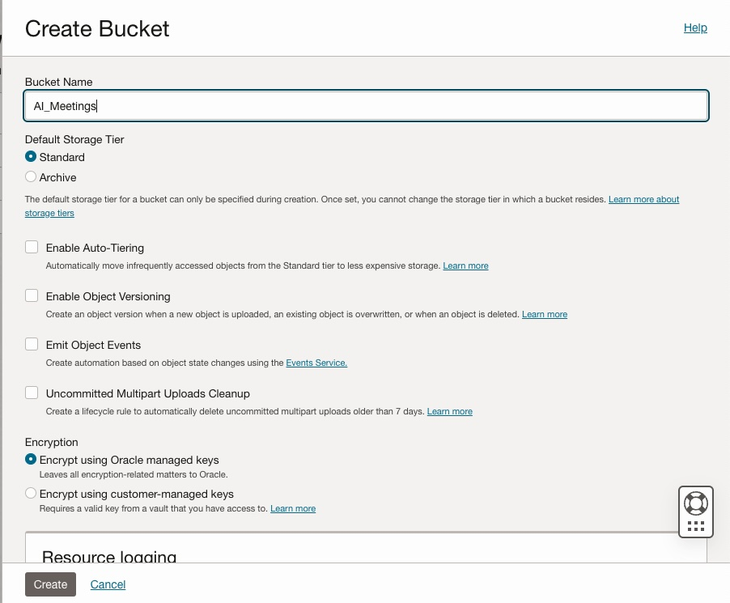

# **4.Open Visual Builder**
## Configure access to REST APIs
* Open Visual Builder and click on the "New" button. Provide a name and an ID, for example "AI_Meetings". Click on finish.
    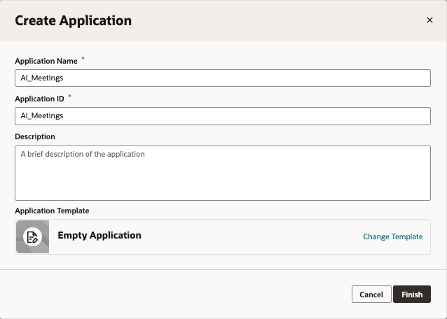

* Now we are going to create a web application. Click on the first icon (web applications)
    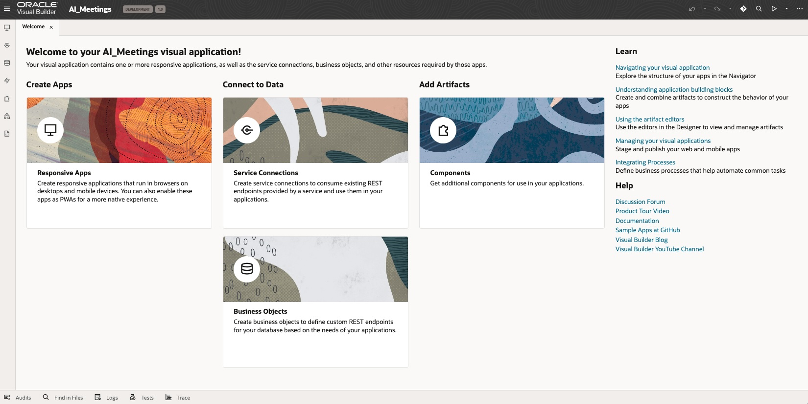
* Now, click on the "+ Web Application" button  
    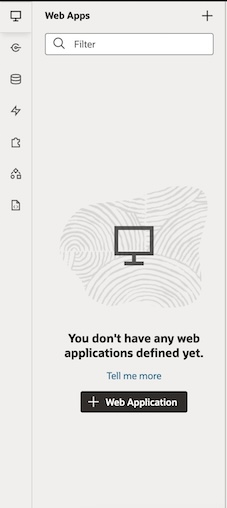  
* Provide an Application name, for example "AI_Meetings"  
    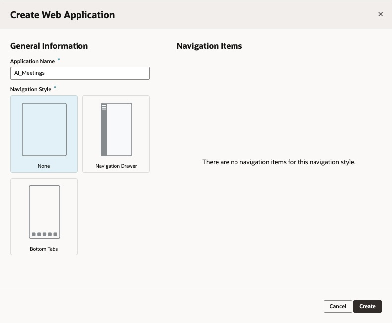
* Let's do the REST Service definition. Click on "+ Service Connection" button
* 
    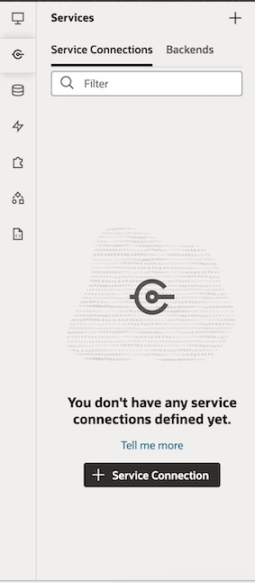
* Choose source "Define by Endpoint"  
    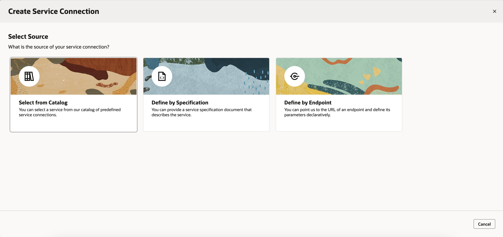
* Provide the OCI Object Storage API Endpoint, being xx-xxxxxx-x your region (example: eu-frankfurt-1). For instance https://objectstorage.xx-xxxxxx-x.oraclecloud.com/n/{namespace}/b/AI_Meetings/o/{objectName}
Enter the Backend Name and select 'Oracle Cloud Infrastructure API Signature 1.0' from the Authentication dropdown menu. Then, click on the pencil icon to proceed 
    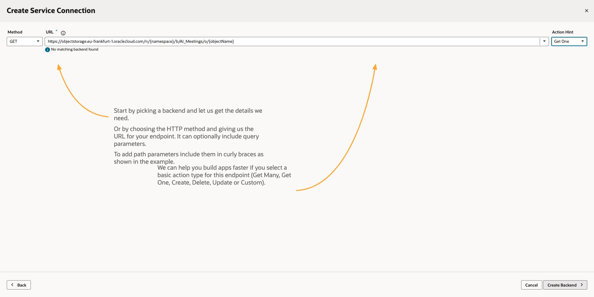
* Enter the data obtained in step 1 in the format ocid.tenancy/ocid.user/key_fingerprint. Paste the content of the Private key file that you downloaded in the first step, then click the 'Save' button. Afterward, proceed by clicking on the 'Next' button
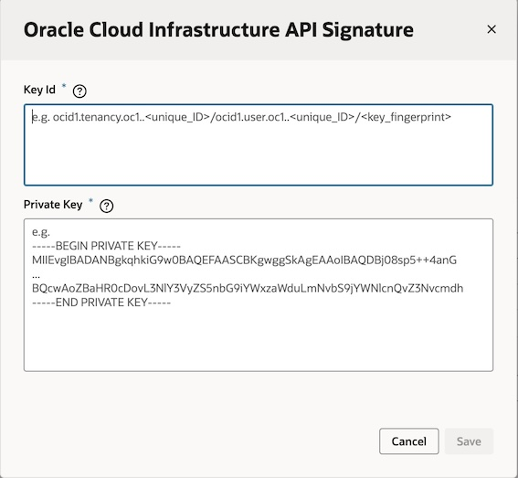
* Include a "service name" and choose "Method" GET and set "Action Hint" to "Get one"  
  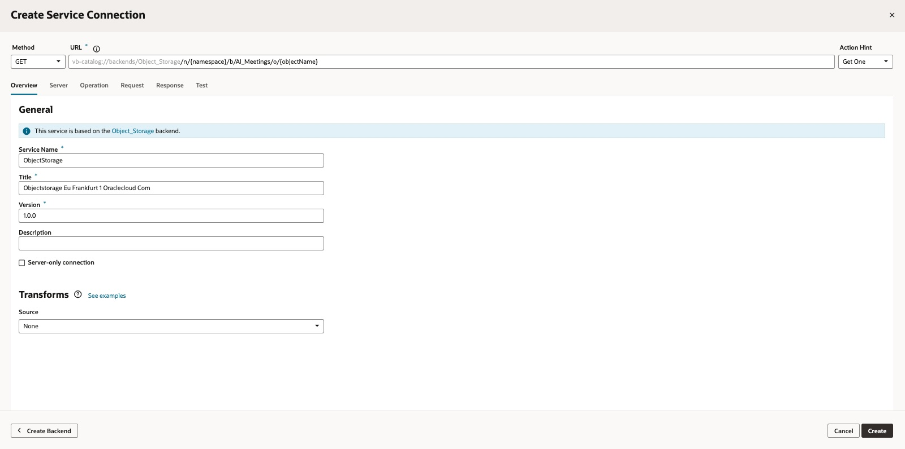
  
* Click on create to finish the wizard. Now, you have an Object Storage backend. 

Let's go to add a new service to the recently created backend OCI Storage API to upload objects and create Preauthenticated requests.

So, add a new service to the storage backend 
[URL]: vb-catalog://backends/objectStorage
/n/{object_storage_namespace}/b/{bucket}/o/{object_name}

- "Method": PUT  
- "Action hint": CREATE  
- Dynamic Headers:
  - Content-Type required, type String
  - Contetn-Disposition required as String
- Request body media type: application/octect-stream

Again, add a new service to the storage backend
   vb-catalog://backends/objectStorage
/n/{object_storage_namespace}/b/{bucket}/p/

- "Method": POST  
- "Action hint": CREATE  
- Dynamic Headers:
  - Content-Type required, type String
  - Content-Disposition required as String
- Request body media type: application/octect-stream

  Repeat the same operation to provide access to the OCI GenAI API to do summarization (select 'Oracle Cloud Infrastructure API Signature 1.0' from the Authentication dropdown menu as you have done with other backends)
So, add a new backend and set the URL

   https://inference.generativeai.xx-xxxxxx-x.oci.oraclecloud.com/20231130/actions/generateText 
  
- "Method": POST  
- "Action hint": CREATE  
- Request body:
~~~
{
"compartmentId":"ocid1.compartment.oc1..aaaaaaaxxxxxnauu3aajpx6pfgtwrxq",
"extractiveness": "AUTO",
"format": "AUTO",
"input": "From the deluge on that election Sunday of 28 March, just one year ago today, to the sweltering epilogue of this scorching May, with the European elections on the horizon.........",
"length": "AUTO",
  "servingMode": {
        "modelId": "cohere.command",
        "servingType": "ON_DEMAND"
    },
"temperature": 0.1
}
~~~

- Response body:
~~~
{
    "id": "0fa30f70-xxxx-xxxx-xxxx-a1697b0d4d68",
    "summary": "A year on from the 28th February coup attempt in Spain, the country is gearing up for European elections while the government continues to push through controversial legislation, such as the Amnesty Law, despite widespread opposition and protests. .........",
    "modelId": "cohere.command",
    "modelVersion": "15.6"
}
~~~

* Repeat the same operation to provide access to the OCI Speech API to carry out the transcription. On this case we will be able to get transcription status (select 'Oracle Cloud Infrastructure API Signature 1.0' from the Authentication dropdown menu as you have done with other backends)
So, add a new backend and set the URL
  (https://speech.aiservice.xx-xxxxxxxxx-x.oci.oraclecloud.com/20220101/transcriptionJobs/{transcriptionJobId})
  
- "Method": GET   
- "Action hint": Get Many  
- Request body:
~~~
{
"compartmentId":"ocid1.compartment.oc1..aaaaaaaxxxxxnauu3aajpx6pfgtwrxq",
"extractiveness": "AUTO",
"format": "AUTO",
"input": "From the deluge on that election Sunday of 28 March, just one year ago today, to the sweltering epilogue of this scorching May, with the European elections on the horizon.........",
"length": "AUTO",
  "servingMode": {
        "modelId": "cohere.command",
        "servingType": "ON_DEMAND"
    },
"temperature": 0.1
}
~~~

- Response body:
~~~
{
    "id": "ocid1.aispeechtranscriptionjob.oc1.eu-frankfurt-1.amaaaxxxxxxxxxthlmzclnsoq",
    "displayName": "job-3b63a754-xxxx-xxxx-839e-d9c3cec24eac.mp3",
    "compartmentId": "ocid1.compartment.oc1..aaaaaaaa4bz2p3xxxxxxxlnauu3aajpx6pfgtwrxq",
    "description": null,
    "modelDetails": {
        "modelType": "WHISPER_MEDIUM",
        "domain": "GENERIC",
        "languageCode": "en",
        "transcriptionSettings": {
            "diarization": {
                "isDiarizationEnabled": true,
                "numberOfSpeakers": 2
            },
            "additionalSettings": null
        }
    },
    "normalization": {
        "isPunctuationEnabled": true,
        "filters": []
    },
    "timeAccepted": "2024-05-23T10:35:27.390Z",
    "timeStarted": "2024-05-23T10:35:27.656Z",
    "timeFinished": "2024-05-23T10:37:55.651Z",
    "totalTasks": 1,
    "outstandingTasks": 0,
    "successfulTasks": 1,
    "ttlInDays": 90,
    "percentComplete": 0,
    "inputLocation": {
        "locationType": "OBJECT_LIST_INLINE_INPUT_LOCATION",
        "objectLocations": [
            {
                "namespaceName": "wedoinfra",
                "bucketName": "AI_Meetings",
                "objectNames": [
                    "3b63a754-xxxx-xxxx-xxxx-d9c3cec24eac.mp3"
                ]
            }
        ]
    },
    "outputLocation": {
        "namespaceName": "xxxxxxxx",
        "bucketName": "AI_Meetings",
        "prefix": "id8bb87ba3aa3f403c8fcd0ee3e924bf9b/job-amaaaaaaqtij3maawinnrnqxxxxxxxxxxxxjqh2x3fthlmzclnsoq/"
    },
    "createdBy": "ocid1.user.oc1..aaaaaaaaexwxxxxxqf5ahow5hgf3tj4upskq",
    "additionalTranscriptionFormats": [],
    "lifecycleState": "SUCCEEDED",
    "lifecycleDetails": null,
    "freeformTags": {},
    "definedTags": {
        "Audit": {
            "creator": "oracleidentitycloudservice/xxxxxxxx@oracle.com at 2024-05-23T10:35:27.251Z"
        }
    },
    "systemTags": {}
}
~~~
  
Now let's goign to add a new service to the recently created backend OCI Speech API to request the transcription status.   

* Now, add a new service connection using (vb-catalog://backends/speech/transcriptionJobs)

- "Method": POST   
- "Action hint": Create  
- Request body:
~~~
{
"compartmentId":"ocid1.compartment.oc1..aaaaaaaa4bz2p36xc2wxxxxxxxxxxxnauu3aajpx6pfgtwrxq",
"displayName":"name",
"inputLocation": {
              "locationType":"OBJECT_LIST_INLINE_INPUT_LOCATION", 
              "objectLocations":
                                    [{
                                       "bucketName":"AI_Meetings", "namespaceName":"xxxxx", "objectNames": ["f93d5e52-xxxx-xxxx-xxxxx-907dd0e2cacc.mp3"] 
                                    }]
                                
                 },
"modelDetails": 
   {
     "languageCode":"en",
      "modelType": "WHISPER_MEDIUM",
     "transcriptionSettings": {
            "diarization": {"isDiarizationEnabled": true, "numberOfSpeakers":2}
       }
   },
"outputLocation": {
                    "bucketName":"AI_Meetings", "namespaceName":"xxxxxxx", "prefix": "idxxx"
                  }
}
~~~

- Response body:
~~~
{
    "id": "ocid1.aispeechtranscriptionjob.oc1.eu-frankfurt-1.amaaaaaavfig65yack6kixxxxxxxxxqe3v6wedleiawpbufaa",
    "displayName": "name",
    "compartmentId": "ocid1.compartment.oc1..aaaaaaaaxxxxxwxxxxxxxxxxajpx6pfgtwrxq",
    "description": null,
    "modelDetails": {
        "modelType": "WHISPER_MEDIUM",
        "domain": "GENERIC",
        "languageCode": "en",
        "transcriptionSettings": {
            "diarization": {
                "isDiarizationEnabled": true,
                "numberOfSpeakers": 2
            },
            "additionalSettings": null
        }
    },
    "normalization": {
        "isPunctuationEnabled": true,
        "filters": []
    },
    "timeAccepted": "2024-03-18T18:36:29.364Z",
    "timeStarted": null,
    "timeFinished": null,
    "totalTasks": 1,
    "outstandingTasks": 1,
    "successfulTasks": 0,
    "ttlInDays": 90,
    "percentComplete": 0,
    "inputLocation": {
        "locationType": "OBJECT_LIST_INLINE_INPUT_LOCATION",
        "objectLocations": [
            {
                "namespaceName": "wedoinfra",
                "bucketName": "AI_Meetings",
                "objectNames": [
                    "idxxx/f93d5e52-b1fb-xxxx-xxxxx-907dd0e2cacc.mp3"
                ]
            }
        ]
    },
    "outputLocation": {
        "namespaceName": "wedoinfra",
        "bucketName": "AI_Meetings",
        "prefix": "idxxx/job-amaaaaaavfig65yaxxxxxx5zohqe3v6wedleiawpbufaa/"
    },
    "createdBy": "ocid1.user.oc1..aaaaaaaaexwuvo3enpxxxxxxx5ahow5hgf3tj4upskq",
    "additionalTranscriptionFormats": [],
    "lifecycleState": "ACCEPTED",
    "lifecycleDetails": null,
    "freeformTags": {},
    "definedTags": {
        "Oracle-Tags": {
            "CreatedBy": "default/xxxxxxx@oracle.com",
            "CreatedOn": "2024-03-18T18:36:29.266Z"
        }
    },
    "systemTags": {}
}
~~~
  

* Repeat the same operation to provide access to the OCI Language API to analyze the transcription.Select 'Oracle Cloud Infrastructure API Signature 1.0' from the Authentication dropdown menu as you have done with other backends.
So, add a new backend and set the URL
  (https://language.aiservice.xx-xxxxxx-x.oci.oraclecloud.com/20221001/actions/batchDetectLanguageSentiments)
  
- "Method": POST   
- "Action hint": Create  
- Request body:
~~~
{
"documents": [
    {
        "key" : "doc1",
        "text" : "OCI recently added new services to existing compliance program including SOC, HIPAA, and ISO to enable our customers to solve their  use cases. We also released new white papers and guidance documents related to  Object Storage, the Australian Prudential Regulation Authority (APRA), and the Central Bank of Brazil. These resources help regulated customers better  understand how OCI supports their regional and industry-specific compliance  requirements. Not only are we expanding our number of compliance offerings and  regulatory alignments, we continue to add regions and services at a faster clip."
    }
]
}
~~~

- Response body:
~~~
{
    "documents": [
        {
            "key": "doc1",
            "documentSentiment": "",
            "documentScores": {},
            "sentences": [],
            "aspects": [
                {
                    "offset": 322,
                    "length": 9,
                    "text": "resources",
                    "sentiment": "Positive",
                    "scores": {
                        "Positive": 0.9814186299929331,
                        "Negative": 0.016609141881639276,
                        "Neutral": 0,
                        "Mixed": 0.001972228125427651
                    }
                }
            ],
            "languageCode": "en"
        }
    ],
    "errors": []
}
~~~
  
* Finally let's go to add a new service to the recently created backend OCI Language API to detect pre-trained entities: (vb-catalog://backends/Language/batchDetectLanguageEntities)
  
- "Method": POST   
- "Action hint": Get Many  
- Request body:
~~~
{
    "documents": [
       {            
            "key": "doc1",             
            "text": " The video demonstrates the capabilities of the Oracle Cloud Language Service. Language detection and text classification capabilities are shown using pre-trained models. The named entity recognition capability can extract entities like .........."         
        }
    ]
}
~~~

- Response body example:

~~~
{
    "documents": [
        {
            "key": "doc1",
            "entities": [
                {
                    "offset": 1,
                    "length": 15,
                    "text": "Red Bull Racing",
                    "type": "ORGANIZATION",
                    "subType": null,
                    "score": 0.9914557536443075,
                    "metaInfo": null
                },
                {
                    "offset": 17,
                    "length": 5,
                    "text": "Honda",
                    "type": "ORGANIZATION",
                    "subType": null,
                    "score": 0.6515498757362366,
                    "metaInfo": null
                },
                {
                    "offset": 28,
                    "length": 9,
                    "text": "four-time",
                    "type": "QUANTITY",
                    "subType": null,
                    "score": 0.9998091459274292,
                    "metaInfo": [
                        {
                            "offset": 28,
                            "length": 9,
                            "text": "four-time",
                            "subType": "UNIT",
                            "score": 0.9998091459274292
                        }
                    ]
                },
                {
                    "offset": 48,
                    "length": 5,
                    "text": "World",
                    "type": "LOCATION",
                    "subType": "NON_GPE",
                    "score": 0.582543671131134,
                    "metaInfo": null
                },
                ...
                ]

~~~

* Lastly add a custom endpoint to provide RAG capabilities around the transcription. 
  - Add the endpoint http://xxx.xx.xxx.xxx:8888/v2/answer/?conv_id={id}
  - We will cover in another session how to create a RAG solution.

* So, finally your service connections will be something similar to this image:

   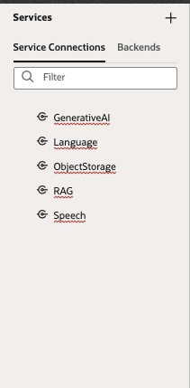

## Create business objects

* Choose business objects panel and add two tables:
  * Meetings: add a string field like meetingName
  * Transcriptions: add some string fields: jobID, jobName and status
  
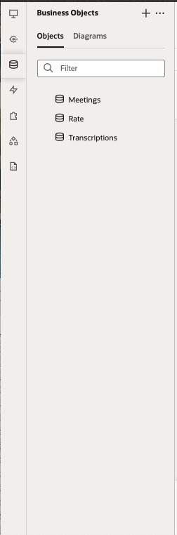

## Build the Web App

- First of all you must create some types &  variables:
    * Type tokenType is a object of spearkerIndex (number) and token (string)
    * Define also following variables:
      * String type: filename, meetingName, jobIdName, jobStatus, parURL, outputlocation, transcriptionText, summaryText, mention, ...
      * Boolean type: loading, uploadSuccess, meetingCreated, transcriptionTask, summaryStatus,  summary, spareTime, ragResponse, query,...
      * Number: fileSize, nParticipants,meetingID, transcriptionID, jobId, positive, negative, mixed, neutral, ...
      * String array: requirements, ...
      * tokenType array: tokenArray, ...
        

- In the components panel, search for "file picker" and drag it onto your canvas. To enhance its appearance, click on the grid layout and switch it to "Flex" mode (found in the properties panel). Set the "Direction" to "vertical" and justify it both "center" and "middle". Next, navigate to the "All" tab, type "style" into the search bar, and provide some CSS styling such as "margin-top:30px;" to achieve the desired spacing. Drop a few components like images and texts.
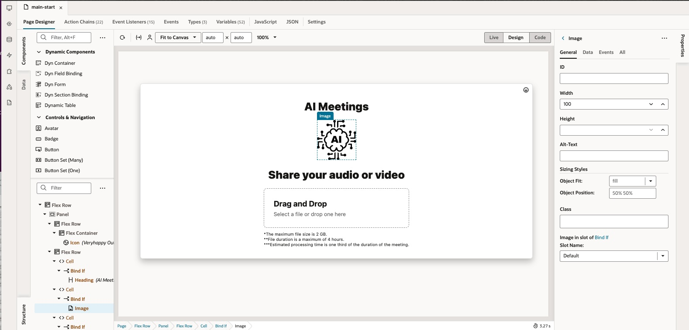

- In the File Picker properties panel provided the supported files that your application will support.  
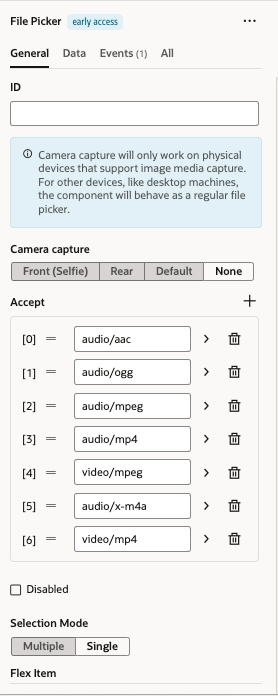

- In the file picker create an event. On this event, you will manage the file upload to the object storage.

~~~
define([
  'vb/action/actionChain',
  'vb/action/actions',
  'vb/action/actionUtils',
], (
  ActionChain,
  Actions,
  ActionUtils
) => {
  'use strict';

  class FilePickerSelectChain extends ActionChain {

    /**
     * @param {Object} context
     * @param {Object} params
     * @param {object[]} params.files 
     */
    async run(context, { files }) {
      const { $page, $flow, $application } = context;

      $page.variables.loading = true;
      let size="";
      if(files[0].size === 0) size= '0 Bytes';
      var k = 1000,
        dm = 2,
        sizes = ['Bytes', 'KB', 'MB', 'GB','TB', 'PB', 'EB', 'ZB', 'YB'],
        i = Math.floor(Math.log(files[0].size) / Math.log(k));
      size= parseFloat((files[0].size / Math.pow(k, i)).toFixed(dm)) + ' ' + sizes[i];
      $page.variables.fileSize = size;

    
      function getExtension(fileName) {
          if (typeof fileName !== 'string' || !fileName) {
              return ''; // Returns an empty string if the input is invalid
          }
          const ultimoPunto = fileName.lastIndexOf(".");
          if (ultimoPunto === -1) return ''; // Returns an empty string if there is no dot in the filename
          return fileName.slice(ultimoPunto + 1);
      }

      function generateUUID() {
          let dt = new Date().getTime();
          const uuid = 'xxxxxxxx-xxxx-4xxx-yxxx-xxxxxxxxxxxx'.replace(/[xy]/g, function(c) {
              const r = (dt + Math.random()*16)%16 | 0;
              dt = Math.floor(dt/16);
              return (c == 'x' ? r : (r&0x3|0x8)).toString(16);
          });
          return uuid;
      }

    let uuid = generateUUID();

    let ext = getExtension(files[0].name);
  
      $page.variables.filename =  uuid+"."+ext;

      const callRestStoragePutObjectResult = await Actions.callRest(context, {
        endpoint: 'Storage/putObject',
        uriParams: {
          bucket: 'AI_Meetings',
          'object_storage_namespace': '{your_namespace}',
          'object_name': $page.variables.filename,
        },
        body: files[0],
      });

      if (callRestStoragePutObjectResult.status===200) {

        $page.variables.uploadSuccess = true;
      } else {
        await Actions.fireNotificationEvent(context, {
          summary: 'There was an error uploading the file',
          displayMode: 'transient',
          type: 'error',
        });
      }
      $page.variables.loading = false;
      return;
    }
  }

  return FilePickerSelectChain;
});
~~~

- Drop a inpunt text to capture the meeting name and a button to create the meeting. So, you can associate a string variable to the input text (example meetingName). We will create the meeting metadata on the business object 
- Associate an ojAction event to the button (it's the action chain):

~~~

define([
  'vb/action/actionChain',
  'vb/action/actions',
  'vb/action/actionUtils',
], (
  ActionChain,
  Actions,
  ActionUtils
) => {
  'use strict';

  class createMeeting extends ActionChain {

    /**
     * @param {Object} context
     */
    async run(context) {
      const { $page, $flow, $application } = context;

      if ($application.functions.isFormValid('oj-validation-group-upload')) {
        $page.variables.loading = true;
        let transcription = true;
        let summarization = true;
        let sentiment = true;
        let temp = "";
        let internalM = true;
        let meetingDesc ="";
         $page.variables.requirements.push("transcription","summarization","sentiment_analysis");

    
        const callRestBusinessObjectsCreateMeetingResult = await Actions.callRest(context, {
          endpoint: 'businessObjects/create_Meetings',
          body: {
         "internalMeeting":  internalM ,
         "meetingName":  $page.variables.meetingName ,
         "meetingDesc":  meetingDesc ,
         "speakersN":  $page.variables.nParticipants ,
         "speakersInvolved":  temp ,
         "transcription":  transcription ,
         "summarization": summarization,
         "sentiment":  sentiment ,
         "fname" : $page.variables.filename,
        },
        });

        if (callRestBusinessObjectsCreateMeetingResult.status===201) {

          $page.variables.currentRequest = callRestBusinessObjectsCreateMeetingResult.body.id;
          $page.variables.meetingID = callRestBusinessObjectsCreateMeetingResult.body.id;
          $page.variables.meetingCreated = true;

        $page.variables.transcriptionID =  $page.variables.meetingID;
          await Actions.callChain(context, {
            chain: 'createTranscriptionJob',
          });

          await Actions.fireNotificationEvent(context, {
            summary: 'Your meeting has been created successfully',
            displayMode: 'transient',
            type: 'confirmation',
          });
        } else {
          await Actions.fireNotificationEvent(context, {
            summary: 'There was a problem creating your meeting',
            type: 'warning',
            displayMode: 'transient',
          });
        }
      } else {
        await Actions.fireNotificationEvent(context, {
          summary: 'The Meeting name is mandatory',
          displayMode: 'transient',
          type: 'warning',
        });
      }

      $page.variables.loading = false;

      return;
    }
  }

  return createMeeting;
});

~~~

* Now we will create another Action chain to create the transcription job using the Speech service.
We will provide information as the compartment, bucket, object and we will update the Transcription table with the relevant information.

~~~

define([
  'vb/action/actionChain',
  'vb/action/actions',
  'vb/action/actionUtils',
], (
  ActionChain,
  Actions,
  ActionUtils
) => {
  'use strict';

  class createTranscriptionJob extends ActionChain {

    /**
     * @param {Object} context
     */
    async run(context) {
      const { $page, $flow, $application } = context;

      const callRestCreateJobPostTranscriptionJobsResult = await Actions.callRest(context, {
        endpoint: 'CreateJob/postTranscriptionJobs',
        body: {
      "compartmentId":"ocid1.compartment.oc1..aaaaaaaa4bxxxxxxauu3aajpx6pfgtwrxq",
      "displayName":"job-"+$page.variables.filename,
      "inputLocation": {
                    "locationType":"OBJECT_LIST_INLINE_INPUT_LOCATION", 
                    "objectLocations":
                                          [{
                                             "bucketName":"AI_Meetings", "namespaceName":"<<your_namespace>>", "objectNames": [$page.variables.filename] 
                                          }]
                                      
                       },
      "modelDetails": 
         {
           "languageCode":"en",
            "modelType": "WHISPER_MEDIUM",
           "transcriptionSettings": {
                  "diarization": {
                    "isDiarizationEnabled": true
                    }
             }
         },
      "outputLocation": {
                          "bucketName":"AI_Meetings", "namespaceName":"<your_namespace>", "prefix": "id"+$application.user.userId
                        }
      },
      });

      if (callRestCreateJobPostTranscriptionJobsResult.status===200 || callRestCreateJobPostTranscriptionJobsResult.status===201) {
        $page.variables.jobIdName = callRestCreateJobPostTranscriptionJobsResult.body.displayName;
        $page.variables.jobStatus = callRestCreateJobPostTranscriptionJobsResult.body.lifecycleState;
        $page.variables.jobId = callRestCreateJobPostTranscriptionJobsResult.body.id;

        const callRestBusinessObjectsCreateTranscriptionsResult = await Actions.callRest(context, {
          endpoint: 'businessObjects/create_Transcriptions',
          body: {
        "jobID": $page.variables.jobId,
        "jobNAME": $page.variables.jobIdName,
        "status": $page.variables.jobStatus
        },
        });

        const callRestBusinessObjectsUpdateMeetingsResult = await Actions.callRest(context, {
          endpoint: 'businessObjects/update_Meetings',
          uriParams: {
            'Meetings_Id': $page.variables.currentRequest,
          },
          body: {
         "transcriptionId": callRestBusinessObjectsCreateTranscriptionsResult.body.id
        },
        });

        await Actions.fireNotificationEvent(context, {
          summary: 'We are processing your request. It will take a while...',
          type: 'info',
          displayMode: 'transient',
        });

        return;
      } else {
        return;
      }
    }
  }

  return createTranscriptionJob;
});

~~~

- Due to it's a sync request, we are going to create a refresh button to check the current transcription status. 
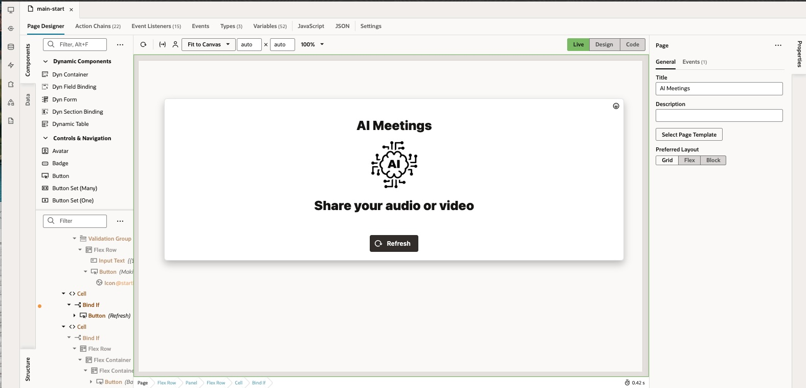
Crate an ojAction event asociated to the button to refresh the page

~~~
define([
  'vb/action/actionChain',
  'vb/action/actions',
  'vb/action/actionUtils',
], (
  ActionChain,
  Actions,
  ActionUtils
) => {
  'use strict';

  class ButtonActionRefresh extends ActionChain {

    /**
     * @param {Object} context
     */
    async run(context) {
      const { $page, $flow, $application } = context;
      window.location.href = window.location.href;
    }
  }

  return ButtonActionRefresh;
});
~~~

- It's time to create an event listener to get the status also when your open the page. So create a vbEnter event with an Action Chain named loadData.
    

~~~
define([
  'vb/action/actionChain',
  'vb/action/actions',
  'vb/action/actionUtils',
], (
  ActionChain,
  Actions,
  ActionUtils
) => {
  'use strict';

  class loadData extends ActionChain {

    /**
     * @param {Object} context
     */
    async run(context) {
      const { $page, $flow, $application } = context;

      if ($page.variables.meetingID >0 ||  $page.variables.parURL) {
      

      $page.variables.loading = true;
        $page.variables.uploadSuccess = true;
        $page.variables.meetingCreated = true;

      await Actions.callChain(context, {
        chain: 'loadMeeting',
      });

        if (!($page.variables.transcriptionID >0)) {
          await Actions.fireNotificationEvent(context, {
            summary: 'Attention',
            message: 'You are trying to access a meeting that doesn\'t exist.',
            displayMode: 'transient',
            type: 'error',
          });

          const navigateToPageMainBrowseResult = await Actions.navigateToPage(context, {
            page: 'main-browse',
          });
        }

      const callRestBusinessObjectsGetTranscriptionsResult = await Actions.callRest(context, {
        endpoint: 'businessObjects/get_Transcriptions',
        uriParams: {
          'Transcriptions_Id': $page.variables.transcriptionID,
        },
      });

      $page.variables.jobId = callRestBusinessObjectsGetTranscriptionsResult.body.jobID;

      const callRestCreateJobGetTranscriptionJobsResult = await Actions.callRest(context, {
        endpoint: 'CreateJob/getTranscriptionJobs',
        uriParams: {
          transcriptionJobId: $page.variables.jobId,
        },
      });

      $page.variables.jobStatus = callRestCreateJobGetTranscriptionJobsResult.body.lifecycleState;
      $page.variables.jobCompletion = callRestCreateJobGetTranscriptionJobsResult.body.percentComplete;
      $page.variables.outputlocation = callRestCreateJobGetTranscriptionJobsResult.body.outputLocation.prefix;

      if (callRestBusinessObjectsGetTranscriptionsResult.body.status!==callRestCreateJobGetTranscriptionJobsResult.body.lifecycleState) {
        const callRestBusinessObjectsUpdateTranscriptionsResult = await Actions.callRest(context, {
          endpoint: 'businessObjects/update_Transcriptions',
          uriParams: {
            'Transcriptions_Id': $page.variables.transcriptionID,
          },
          body: {
                    "status":  $page.variables.jobStatus,
                },
        });
      }

      if (callRestCreateJobGetTranscriptionJobsResult.body.lifecycleState==='SUCCEEDED') {

        const currentDate = new Date();
        // Add 3 hours to the current time
        currentDate.setHours(currentDate.getHours() + 3);
        // Convert the date to RFC 3339 format
        const rfc3339Date = currentDate.toISOString();
        // Remove the milliseconds and 'Z' at the end, then append the timezone offset
        const expirationTime = rfc3339Date.split('.')[0] + currentDate.toISOString().slice(19);

        let urlTemp = $page.variables.outputlocation +'<namespace>_AI_Meetings_'+ callRestCreateJobGetTranscriptionJobsResult.body.inputLocation.objectLocations[0].objectNames[0]+'.json';
        const callRestStorageCreatePARResult = await Actions.callRest(context, {
          endpoint: 'Storage/createPAR',
          uriParams: {
            bucketName: 'AI_Meetings',
            namespaceName: '<namespace>',
          },
          body: {
        "accessType": "ObjectRead",
        "name": "PARTest",
        "objectName": urlTemp,
        "timeExpires": expirationTime
        },
        });

          $page.variables.spareTime = false;

        $page.variables.parURL = callRestStorageCreatePARResult.body.fullPath;
        let tokens=[];

          async function procesarTranscripciones() {
              try {
                        // Get the JSON from the URL
                        const respuesta = await fetch($page.variables.parURL);
                        const datos = await respuesta.json();
                        // Check if the JSON is in the expected format
                        if (!datos.transcriptions || !Array.isArray(datos.transcriptions)) {
                            console.error('The JSON is not in the expected format.');
                            return;
                        }
                        const conversation = datos.transcriptions[0].transcription;
                         $page.variables.transcriptionText = conversation;
                        
                  
                        
                        
                        const speakers = datos.transcriptions[0].speakerCount;       
                        $page.variables.nParticipants = speakers; 
                        const callRestBusinessObjectsUpdateTranscriptionsResult = await Actions.callRest(context, {
                            endpoint: 'businessObjects/update_Meetings',
                            uriParams: {
                                'Meetings_Id': $page.variables.meetingID,
                            },
                            body: {
                                "speakersN": Number(speakers),
                            },
                        });
                        
                        // Initialise an object to separate tokens by speaker
                        const tokensBySpeaker = {};
                        for (let i = 0; i < speakers; i++) {
                            tokensBySpeaker[`Speaker${i}`] = [];
                        }
                    
                        
                       tokens = datos.transcriptions[0].tokens;
                   
                        if (!tokens) {
                            console.error('No tokens were found in the transcription');
                            return;
                        }
                        
                        // Iterate through tokens and sort them out
                        for (const token of tokens) {
                            if (tokensBySpeaker.hasOwnProperty(`Speaker${token.speakerIndex}`)) {
                                tokensBySpeaker[`Speaker${token.speakerIndex}`].push(token.token);
                            } 
                        }
                        
                        
                        // Print the results
                        for (let i = 0; i < speakers; i++) {
                            console.log(`Tokens Speaker ${i}:`, tokensBySpeaker[`Speaker${i}`].join(' '));
                        }
                    
                        return;
                      
                } catch (error) {
                  // Error handling (e.g. network or parse problem)
                  console.error('Error getting or processing JSON:', error);
                  return false;
                      }
            }
          
            let result = await procesarTranscripciones();
            let groupWords = await agruparPorSpeaker(tokens);
            $page.variables.tokenArray=groupWords;
        $page.variables.transcriptionTask = true;

            function agruparPorSpeaker(tokens) {
                  const agrupados = [];
                  let currentSpeaker = null;
                  let currentText = "";

                  tokens.forEach(token => {
                      if (token.speakerIndex !== currentSpeaker) {
                          if (currentSpeaker !== null) {
                              agrupados.push({
                                  speakerIndex: currentSpeaker,
                                  token: currentText.trim()
                              });
                          }
                          currentSpeaker = token.speakerIndex;
                          currentText = token.token;
                      } else {
                          currentText += " " + token.token;
                      }
                  });

                  if (currentSpeaker !== null) {
                      agrupados.push({
                          speakerIndex: currentSpeaker,
                          token: currentText.trim()
                      });
                  }

                  return agrupados;
              }

         await Actions.callChain(context, {
        chain: 'sentimentDetection',
      });

      await Actions.callChain(context, {
        chain: 'summarization',
      });

          await Actions.callChain(context, {
            chain: 'ActionPeopleMentions',
          });

      $page.variables.loading=false;
        
      } else if (callRestCreateJobGetTranscriptionJobsResult.body.lifecycleState==='IN_PROGRESS') {
          $page.variables.loading = true;
          $page.variables.spareTime = true;

      }
    
    

    }
    }
  }

  return loadData;
});

~~~

- We need to create a few more action chains to request sentiment analysis, summarization and mentions.
Please note that there are limitations on the size of the text to be summarised or analysed. So we will do chunking when necessary.

- Action chain for sentiment detection

~~~
define([
  'vb/action/actionChain',
  'vb/action/actions',
  'vb/action/actionUtils',
], (
  ActionChain,
  Actions,
  ActionUtils
) => {
  'use strict';

  class sentimentDetection extends ActionChain {

    /**
     * @param {Object} context
     */
    async run(context) {
      const { $page, $flow, $application } = context;
      
      $page.variables.loading = true;
      await processSentimentAnalysis();
      $page.variables.loading = false;
    

    async function processSentimentAnalysis() {
      const text = $page.variables.transcriptionText;
      const chunkSize = 4999; // Adjust based on API limits
      const chunks = splitText(text, chunkSize);

      const sentimentResults = await Promise.all(chunks.map(async (chunk, index) => {
        return callSentimentAnalysisAPI(chunk, index);
      }));

      compileSentimentResults(sentimentResults);
    }

    function splitText(text, chunkSize) {
      const chunks = [];
      let startIndex = 0;

      while (startIndex < text.length) {
        let endIndex = startIndex + chunkSize;
        if (endIndex > text.length) {
          endIndex = text.length;
        } else {
          while (endIndex > startIndex && text[endIndex] !== ' ') {
            endIndex--;
          }

          if (endIndex === startIndex) {
            endIndex = Math.min(startIndex + chunkSize, text.length);
          }
        }

        const chunk = text.slice(startIndex, endIndex).trim();
        chunks.push(chunk);
        startIndex = endIndex + 1;
      }

      return chunks;
    }

    async function callSentimentAnalysisAPI(text, index) {
      return Actions.callRest(context, {
        endpoint: 'SentimentAnalysis/postBatchDetectLanguageSentiments',
        body: {
          documents: [
            {
              key: `doc${index}`,
              text: text,
            },
          ],
        },
        uriParams: {
          level: 'SENTENCE',
        },
      });
    }

function compileSentimentResults(results) {
  let allSentiments = [];
  let totalPositive = 0;
  let totalNegative = 0;
  let totalNeutral = 0;
  let totalMixed = 0;
  let count = 0;

  results.forEach(result => {
    if (result.status === 200) {
      try {
        const documentSentiment = result.body.documents[0].documentSentiment;
        const scores = result.body.documents[0].documentScores;

        totalPositive += scores.Positive;
        totalNegative += scores.Negative;
        totalNeutral += scores.Neutral;
        totalMixed += scores.Mixed;
        count++;

        const data = result.body.documents[0].sentences;
        const processedData = data.map(item => {
          const scores = item.scores;
          const highestScore = Object.keys(scores).reduce((a, b) => scores[a] > scores[b] ? a : b);
          return {
            sentence: item.text,
            sentiment: item.sentiment,
            value: (scores[highestScore] * 100).toFixed(2) // Convert to percentage and round to two decimals
          };
        });
        allSentiments = allSentiments.concat(processedData);
      } catch (error) {
        Actions.fireNotificationEvent(context, {
          summary: 'Attention',
          message: 'There was an error processing the sentiment data',
          displayMode: 'transient',
          type: 'warning',
        });
      }
    }
  });

  // Calculate averages
  if (count > 0) {
    $page.variables.positive = (totalPositive / count).toFixed(2);
    $page.variables.negative = (totalNegative / count).toFixed(2);
    $page.variables.neutral = (totalNeutral / count).toFixed(2);
    $page.variables.mixed = (totalMixed / count).toFixed(2);

    $page.variables.chartDataArray[0].value = $page.variables.positive ;
    $page.variables.chartDataArray[1].value = $page.variables.negative ;
    $page.variables.chartDataArray[2].value = $page.variables.neutral ;
    $page.variables.chartDataArray[3].value = $page.variables.mixed ;
 
  }

  $page.variables.tableArray = allSentiments;
}

  }
  }
  return sentimentDetection;
});

~~~

- Action chain for summarization. We will do chunking too.
~~~
define([
  'vb/action/actionChain',
  'vb/action/actions',
  'vb/action/actionUtils',
], (
  ActionChain,
  Actions,
  ActionUtils
) => {
  'use strict';

  class SummarizationChunks extends ActionChain {

    /**
     * @param {Object} context
     */
    async run(context) {
      const { $page, $flow, $application } = context;
      
      
      async function splitText(text, chunkSize) {
      const chunks = [];
      let startIndex = 0;
      
      while (startIndex < text.length) {
        let endIndex = startIndex + chunkSize;
      
        if (endIndex > text.length) {
          endIndex = text.length;
        } else {
          while (endIndex > startIndex && text[endIndex] !== ' ') {
            endIndex--;
          }
      
          if (endIndex === startIndex) {
            endIndex = Math.min(startIndex + chunkSize, text.length);
          }
        }
      
        const chunk = text.slice(startIndex, endIndex).trim();
        chunks.push(chunk);
        startIndex = endIndex + 1;
      }
      
      return chunks;
          }
      
          async function summarizeText(text) {
                const chunkSize = 3500; // Example chunk size
                const chunks = await splitText(text, chunkSize);
                
                const summaries = await Promise.all(chunks.map(async chunk => {
                return await summarizeChunk(chunk);
                }));
                
                const combinedSummary = summaries.join(' ');
                return combinedSummary;
          }
      
          async function summarizeChunk(text) {
            const callRestSummarizationPostSummarizeTextResult = await Actions.callRest(context, {
                endpoint: 'Summarization/postSummarizeText',
                body: {
                "compartmentId": "ocid1.compartment.oc1..aaaaaaaa4bz2p36xc2wxxxxxxxx5jmm5gtlnauu3aajpx6pfgtwrxq",
                "extractiveness": $page.variables.extractiveness,
                "format": $page.variables.format,
                "input": text,
                "length": $page.variables.length,
                "servingMode": {
                    "modelId": "cohere.command",
                    "servingType": "ON_DEMAND"
                },
                "temperature": 0.0
                },
            });
            return callRestSummarizationPostSummarizeTextResult.body.summary;
          }
      
          async function startSummarization() {
                const text = $page.variables.transcriptionText; 
                let result = await summarizeText(text);
                console.log("Result: " + result);
                $page.variables.summaryText=result;
          }

            const size = $page.variables.transcriptionText.length;
            if (size < 250) {
                $page.variables.minimumSize = true;
                $page.variables.summaryStatus = true;
                return;
            }

    if (size < 3500) {
            $page.variables.loading = true;
              const callRestSummarizationPostSummarizeTextResult3 = await Actions.callRest(context, {
            endpoint: 'Summarization/postSummarizeText',
            body: {
              "compartmentId": "ocid1.compartment.oc1..aaaaaaaa4bz2p36xcxxxxxxajpx6pfgtwrxq",
              "extractiveness": $page.variables.extractiveness,
              "format": $page.variables.format,
              "input": $page.variables.transcriptionText,
              "length": $page.variables.length,
              "servingMode": {
                "modelId": "cohere.command",
                "servingType": "ON_DEMAND"
              },
              "temperature": 0.0
            },
          });
          $page.variables.summaryText=callRestSummarizationPostSummarizeTextResult3.body.summary;
            $page.variables.loading = false;
            $page.variables.summaryStatus = true;
            return;
      }else{
          $page.variables.loading = true;
          await startSummarization(context);
          const callRestSummarizationPostSummarizeTextResult2 = await Actions.callRest(context, {
            endpoint: 'Summarization/postSummarizeText',
            body: {
                "compartmentId": "ocid1.compartment.oc1..aaaaaaaa4bz2p36xc2wxxxxxxx5gtlnauu3aajpx6pfgtwrxq",
                "extractiveness": $page.variables.extractiveness,
                "format": $page.variables.format,
                "input": $page.variables.summaryText,
                "length": $page.variables.length,
                "servingMode": {
                  "modelId": "cohere.command",
                  "servingType": "ON_DEMAND"
                },
                "temperature": 0.0
              },
              });
            $page.variables.summaryText=callRestSummarizationPostSummarizeTextResult2.body.summary;
            $page.variables.loading = false;
            $page.variables.summaryStatus = true;
            return;
      }
  }
  }
  return SummarizationChunks;
  
});

~~~

- Action chain for mentions using AI Language
~~~
define([
  'vb/action/actionChain',
  'vb/action/actions',
  'vb/action/actionUtils',
], (
  ActionChain,
  Actions,
  ActionUtils
) => {
  'use strict';

  class ActionPeopleMentions extends ActionChain {

    /**
     * @param {Object} context
     */
    async run(context) {
      const { $page, $flow, $application } = context;

  async function startMentioning() {
      const text = $page.variables.transcriptionText; // Ensure this is properly initialized and accessible
      let result = await analyzeText(text);

      console.log("Result: " + result);
    }
    await startMentioning();
    $page.variables.languageProcessingFinish=true;
    $page.variables.loading =false;

    async function splitText(text, chunkSize) {
      const chunks = [];
      let startIndex = 0;

      while (startIndex < text.length) {
        let endIndex = startIndex + chunkSize;

        if (endIndex > text.length) {
          endIndex = text.length;
        } else {
          while (endIndex > startIndex && text[endIndex] !== ' ') {
            endIndex--;
          }

          if (endIndex === startIndex) {
            endIndex = Math.min(startIndex + chunkSize, text.length);
          }
        }

        const chunk = text.slice(startIndex, endIndex).trim();
        chunks.push(chunk);
        startIndex = endIndex + 1;
      }

      return chunks;
    }

    async function analyzeText(text) {
      const chunkSize = 3500; // Example chunk size
      const chunks = await splitText(text, chunkSize);

      const analysis = await Promise.all(chunks.map(async chunk => {
        return mentionAnalysis(chunk);
      }));
      return;
    }
    
  
  function processEntities(data) {   
    try{ 
        data.documents[0].entities.forEach(entity => {
            if ((entity.type === "PERSON") && (entity.score>0.7)) {
                $page.variables.arrayMention.push(entity.text);
            } else if ((entity.type === "ORGANIZATION") && (entity.score>0.8)) {
                $page.variables.arrayOrg.push(entity.text);
            } else if ((entity.type === "PRODUCT") && (entity.score>0.8)) {
                $page.variables.arrayProduct.push(entity.text);
            } else if ((entity.type === "DATETIME") && (entity.score>0.8)) {
                $page.variables.arrayDatetime.push(entity.text);
            }else if ((entity.type === "LOCATION") && (entity.score>0.8)) {
                $page.variables.arrayLocation.push(entity.text);
            }
        })
 } catch (error) {
      console.error(error);
 }

    $page.variables.arrayMention = [...new Set($page.variables.arrayMention)];
    $page.variables.arrayOrg = [...new Set($page.variables.arrayOrg)];
    $page.variables.arrayProduct = [...new Set($page.variables.arrayProduct)];
    $page.variables.arrayLocation = [...new Set($page.variables.arrayLocation)];
    $page.variables.arrayDatetime = [...new Set($page.variables.arrayDatetime)];
    
    let json = {"personEntities": $page.variables.arrayMention, "orgEntities": $page.variables.arrayOrg};
    return json; 
}

    async function mentionAnalysis(text) {
       const callRestSentimentAnalysisDetectLanguageEntitiesResult = await Actions.callRest(context, {
        endpoint: 'SentimentAnalysis/DetectLanguageEntities',
        body: {
          "documents": [
      {             "key": "doc1", "text": text
               }
          ]
      },
      });
      const callFunctionResult = processEntities(callRestSentimentAnalysisDetectLanguageEntitiesResult.body);
      return true;
    
    }

      return;
    }
  }
  
  return ActionPeopleMentions;
});

~~~

- Now, let's drop and configure some components to show the information.
  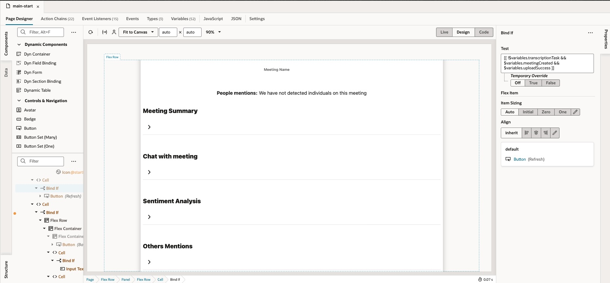

- Sample use case:
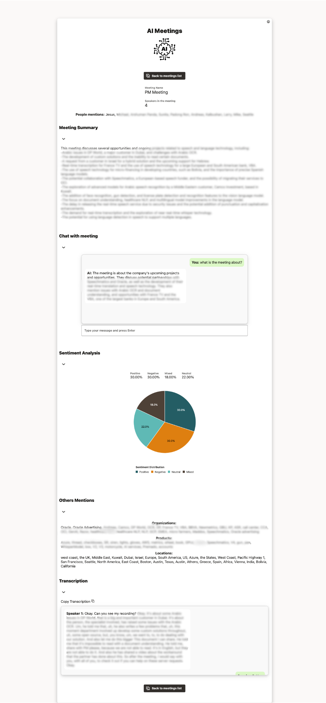

- If you want to import my project and start to use it, please first of all you must do some configurations.
    * Edit server configurations to add your credentials (user ocid, user fingerprint, tenant ocid and your private certificate)
    * Provide values to application variables: namespace, bucket & your ocid compartmment.

## I hope you liked it. From today you can make your meetings smarter!
Author: Jesús Brasero