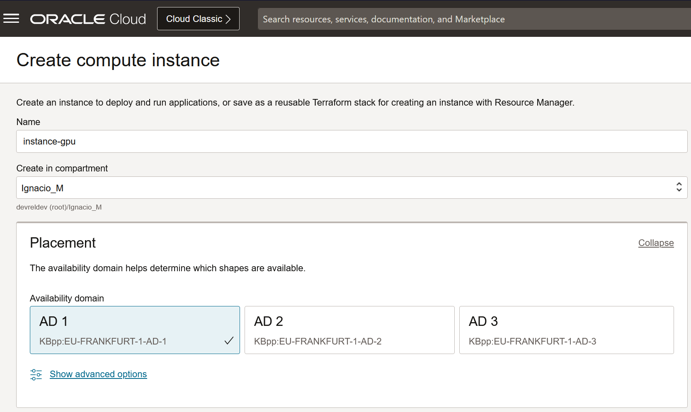
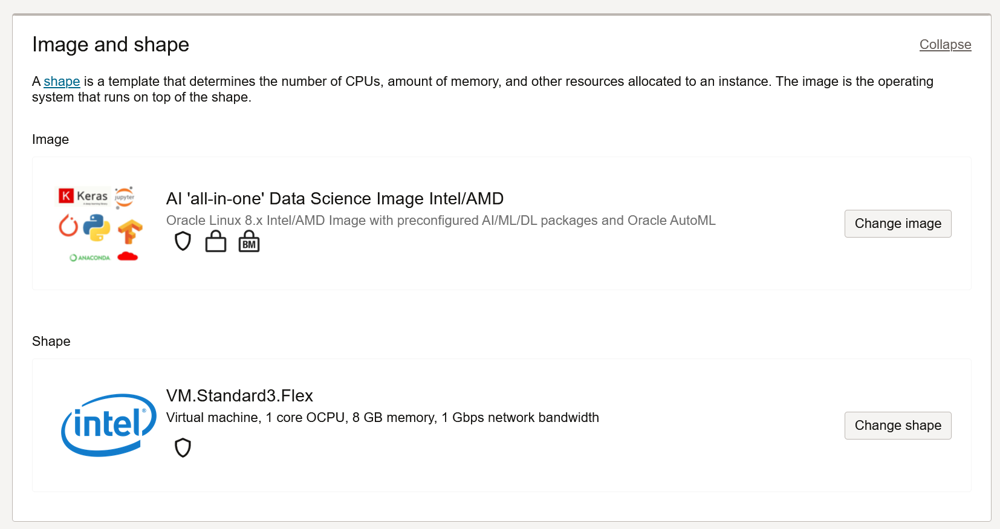
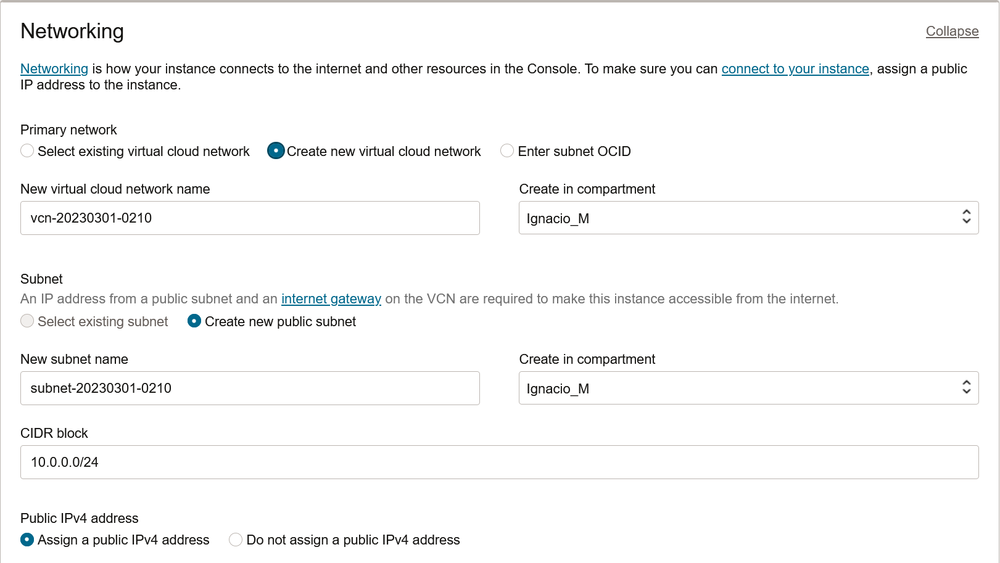
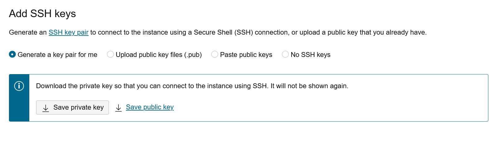
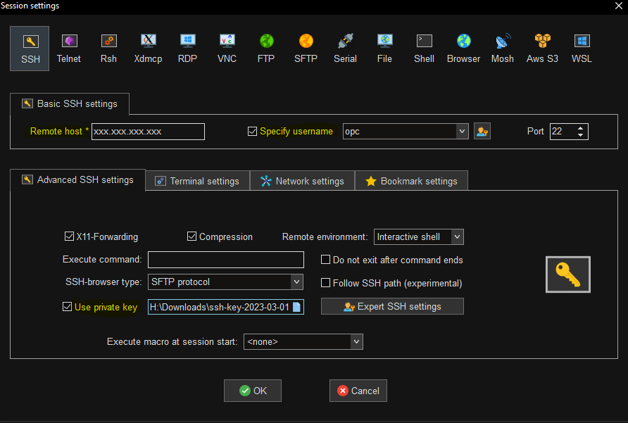
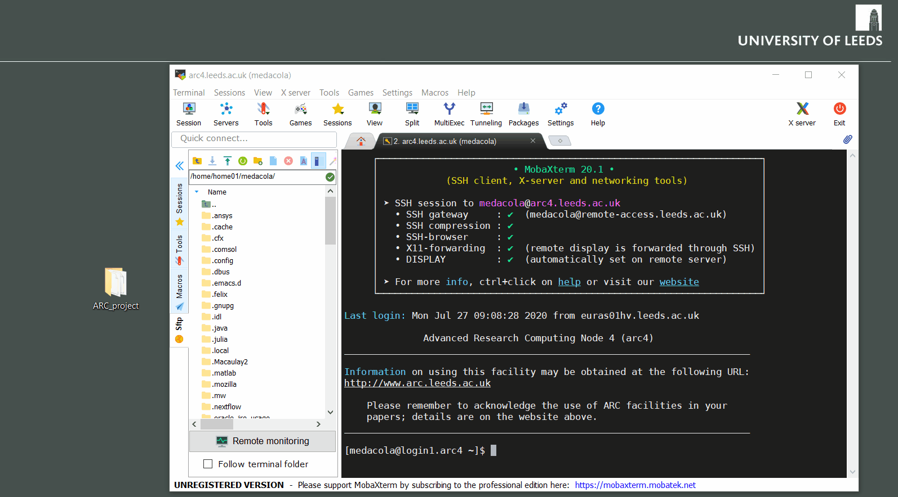

# Lab 2: Infrastructure

Estimated Time: 10 minutes

## Introduction

In this lab, we will quickly prepare the infrastructure that we need to manually train our Computer Vision model **in the next workshop**. From this infrastructure, we will learn how to do the things that we've done with RoboFlow during *this* workshop (training, data augmentation), but using 100% open-source code.

The OCI service that we'll use for this is **OCI Compute**. 

## Task 1: Create OCI Instance

First, we'll go into our [OCI Compute panel](https://cloud.oracle.com/compute/instances) and create a new instance. The name of the instance can be anything you want, and you should choose the Availability Domain (AD) depending on your region and the AD's allocated resources (varies over time). I usually go with AD 1, and if I run into any issues, I iterate.



We're going to use a **platform image** from Oracle called **OCI DSVM**. This image contains several tools for data exploration, analysis, modeling, and development. It also includes a Jupyter Notebook, a conda environment ready to use, and several more things (like Christmas for a Data practitioner).



We can find the platform image by selecting the *Marketplace* button:


Network settings for the Virtual Machine are very standard. Just make sure to create a new VCN and a new subnet, so that there's no possible way we get any networking issues from other OCI projects you may have.


Finally, we'll let OCI generate an SSH keypair, which we'll use to connect to the machine.



## Task 2: Access OCI Instance

To access our instance, let's copy the primary IP address that was allocated to our VM once the provisioning of this machine is done.


Once we have the IP address and having previously saved our public-private key pair (which is what we will use to authenticate ourselves to the machine), let's connect through SSH. 


### Linux & macOS Users

Open a new terminal and run:

```
<copy>
ssh -i <private_key_absolute_path> opc@IP_ADDRESS
</copy>
```

For example, I have my SSH keypair saved in my downloads folder. Imagine my VM's IP address is 192.168.0.1. I will execute:

```
<copy>
ssh -i /home/user/Downloads/my_key.key opc@192.168.0.1
</copy>
```
> **Note**: `opc` is the default user for Oracle Linux Operating Systems, like the one running in our VM.

### Windows Users

For Windows users, I recommend using [MobaXterm](https://mobaxterm.mobatek.net/). 

First, set up a new session, making sure to specify the remote host (IP address), the username (opc), and the private key's location:



Now, just click on "Quick Connect" and connect:


> **Note**: we will connect to our VM  and start training / augmenting our data with open-source repositories. 

## Task 3: Clone Open-Source Repositories 

Once we have connected to our instance, let's download two repositories: YOLOv5 and YOLOv8. You're free to choose either one of them to train and augment our computer vision models, but this guide will show you how to proceed with YOLOv5.

Run the following commands:

```
<copy>
# download yolov5
git clone https://github.com/ultralytics/yolov5.git 
# download yolov8*
git clone https://github.com/ultralytics/ultralytics.git
</copy>
```
> **Note**: `git` is another tool that's already installed in the custom image we used to spin up our instance. *YOLOv8 can also be installed directly from pip. More information [in this link.](https://github.com/ultralytics/ultralytics#documentation)

## Task 4: Transfer Dataset

Now that we're connected to the machine, let's move the files from our computer to our OCI Compute Instance.

### For Linux & macOS Users

We can use the _`scp`_ tool to help us transfer files through SSH:

```
<copy>
scp -i ~/.ssh/id_rsa.pub FILENAME USER@SERVER:/home/USER/FILENAME
</copy>
```
> **Note**: the _`-r`_ option stands for recursive (we must give it a directory instead of a file name).
So, in our case, it will be:

```
<copy>
scp -i ~/.ssh/id_rsa.pub -r /home/$USER/Downloads/dataset_directory opc@192.168.0.1:/home/$USER/final_directory
</copy>
```
> **Note**: in this case, my OCI Compute Instance IP is 192.168.0.1. `opc` is the username for Oracle Linux distributions, like the one we are using for this case. And the private key shall be the one we used to connect through SSH in the previous task.


### For Windows Users 

Use the integrated MobaXterm FTP explorer to transfer files, dropping files from our computer to MobaXterm's explorer, like here but the opposite:



## Task 5: Install Python Dependencies

Once we have the repositories ready, we need to install dependencies that will allow us to run YOLO code:

```console
cd /home/$USER/yolov5
pip install -r /home/$USER/yolov5/requirements.txt
```

Now that we have cloned our repositories, uploaded our dataset, and have our machine and conda environment ready, we're virtually ready to start training. You may now [proceed to the next lab](#next).

## Acknowledgements

* **Author** - Nacho Martinez, Data Science Advocate @ Oracle DevRel
* **Last Updated By/Date** - March 10th, 2023