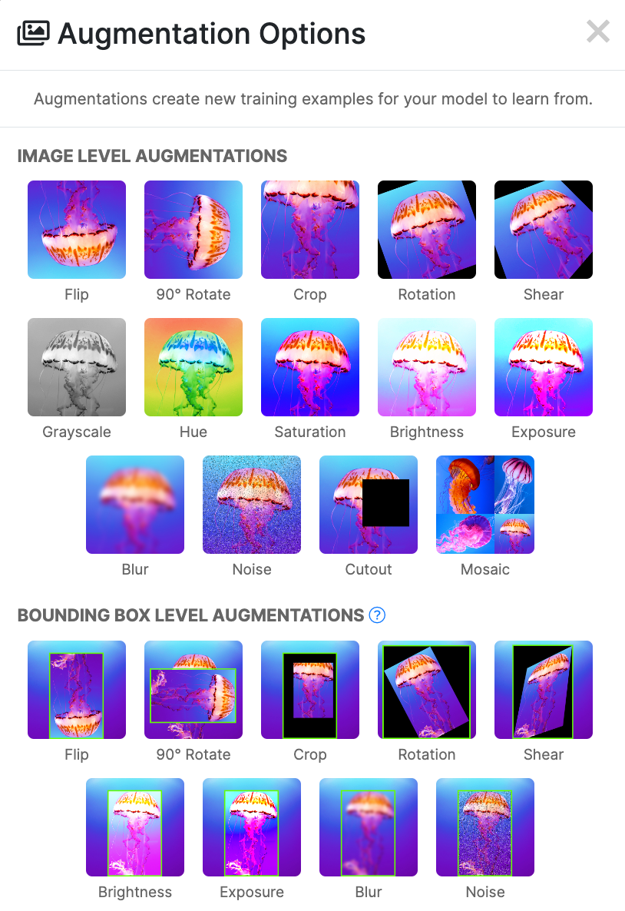

# Lab 2: Augment Dataset & Train Model

Estimated Time: 40 minutes

## Task 1: Hyperparameters & Checkpoints

The most important part of training a model is choosing the right **hyperparameters**. In this section, I'll explain the parameters I usually use, and why these are recommended for this specific problem.

Then, once we have the hyperparameters set, we just need to launch the training process.

### Training Parameters

We're ready to make a couple of extra decisions regarding which parameters we'll use during training.

It's important to choose the right parameters, as doing otherwise can cause terrible models to be created. So, let's dive deep into what's important about training parameters. Official documentation can be found [here](https://docs.ultralytics.com/config/).

* `--device`: specifies which CUDA device (or by default, CPU) we want to use. Since we're working with an OCI CPU Instance, let's set this to "cpu", which will perform training with the machine's CPU.
* `--epochs`: the total number of epochs we want to train the model for. If the model doesn't find an improvement during training. I set this to 3000 epochs, although my model converged very precisely long before the 3000th epoch was done.
    
    > **Note**: YOLOv5 (and lots of Neural Networks) implement a function called **early stopping/patience**, which will stop training before the specified number of epochs if it can't find a way to improve the mAPs (Mean Average Precision) for any class.

* `--batch`: the batch size. I set this to either 16 images per batch, or 32. Setting a lower value (and considering that my dataset already has 10,000 images) is usually a *bad practice* and can cause instability.
* `--lr`: I set the learning rate to 0.01 by default.
* `--img` (image size): this parameter was probably the one that gave me the most trouble. I initially thought that all images -- if trained with a specific image size -- must always follow this size; however, you don't need to worry about this due to image subsampling and other techniques that are implemented to avoid this issue. This value needs to be the maximum value between the height and width of the pictures, averaged across the dataset.
* `--save_period`: specifies how often the model should save a copy of the state. For example, if I set this to 25, it will create a YOLOv5 checkpoint that I can use every 25 trained epochs.
* `--hyp`: specifies a custom YAML file that will contain the set of hyperparameters for our model. We will talk more specifically about this property in the next section.

> **Note**: if I have 1,000 images with an average width of 1920 and height of 1080, I'll probably create a model of image size = 640, and subsample my images. If I have issues with detections, perhaps I'll create a model with a higher image size value, but training time will ramp up, and inference will also require more computing power.

### YOLO Checkpoints - Which one to choose from?

The second and last decision we need to make is which YOLOv5 checkpoint we're going to start from. It's **highly recommended** that you start training from one of the possible checkpoints:


> **Note**: you can also start training 100% from scratch, without any checkpoints. You should only do this if what you're trying to detect has never been reproduced before, e.g. astrophotography. The upside of using a checkpoint is that YOLOv5 has already been trained up to a point, with real-world data. So, anything that resembles the real world can easily be trained from a checkpoint, which will help you reduce training time (and therefore expense).

The higher the average precision from each checkpoint, the more parameters it contains (typically). Here's a detailed comparison with all available pre-trained checkpoints:

| Model | size<br><sup>(pixels)</sup> | Mean Average Precision<sup>val<br>50-95</sup> | Mean Average Precision<sup>val<br>50</sup> | Speed<br><sup>CPU b1<br>(ms)</sup> | Speed<br><sup>V100 b1<br>(ms)</sup> | Speed<br><sup>V100 b32<br>(ms)</sup> | Number of parameters<br><sup>(M)</sup> | FLOPs<br><sup>@640 (B)</sup> |
| ----- | ------------ | ------------------------------ | --------------------------- | --------------- | ---------------- | ----------------- | ----------------------- | ------------- |
| [YOLOv5n](https://github.com/ultralytics/yolov5/releases/download/v6.2/yolov5n.pt) | 640 | 28.0 | 45.7 | **45** | **6.3** | **0.6** | **1.9** | **4.5** |
| [YOLOv5s](https://github.com/ultralytics/yolov5/releases/download/v6.2/yolov5s.pt) | 640 | 37.4 | 56.8 | 98 | 6.4 | 0.9 | 7.2 | 16.5 |
| [YOLOv5m](https://github.com/ultralytics/yolov5/releases/download/v6.2/yolov5m.pt) | 640 | 45.4 | 64.1 | 224 | 8.2 | 1.7 | 21.2 | 49.0 |
| [YOLOv5l](https://github.com/ultralytics/yolov5/releases/download/v6.2/yolov5l.pt) | 640 | 49.0 | 67.3 | 430 | 10.1 | 2.7 | 46.5 | 109.1 |
| [YOLOv5x](https://github.com/ultralytics/yolov5/releases/download/v6.2/yolov5x.pt) | 640 | 50.7 | 68.9 | 766 | 12.1 | 4.8 | 86.7 | 205.7 |
|  |  |  |  |  |  |  |  |  |
| [YOLOv5n6](https://github.com/ultralytics/yolov5/releases/download/v6.2/yolov5n6.pt) | 1280 | 36.0 | 54.4 | 153 | 8.1 | 2.1 | 3.2 | 4.6 |
| [YOLOv5s6](https://github.com/ultralytics/yolov5/releases/download/v6.2/yolov5s6.pt) | 1280 | 44.8 | 63.7 | 385 | 8.2 | 3.6 | 12.6 | 16.8 |
| [YOLOv5m6](https://github.com/ultralytics/yolov5/releases/download/v6.2/yolov5m6.pt) | 1280 | 51.3 | 69.3 | 887 | 11.1 | 6.8 | 35.7 | 50.0 |
| [YOLOv5l6](https://github.com/ultralytics/yolov5/releases/download/v6.2/yolov5l6.pt) | 1280 | 53.7 | 71.3 | 1784 | 15.8 | 10.5 | 76.8 | 111.4 |
| [YOLOv5x6](https://github.com/ultralytics/yolov5/releases/download/v6.2/yolov5x6.pt)<br>+[TTA](https://github.com/ultralytics/yolov5/issues/303) | 1280<br>1536 | 55.0<br>**55.8** | 72.7<br>**72.7** | 3136<br>- | 26.2<br>- | 19.4<br>- | 140.7<br>- | 209.8<br>- |

> **Note**: all checkpoints have been trained for 300 epochs with the default settings (find all of them [in the official docs](https://docs.ultralytics.com/config/)). The nano and small version use [these hyperparameters](https://github.com/ultralytics/yolov5/blob/master/data/hyps/hyp.scratch-low.yaml), all others use [these](https://github.com/ultralytics/yolov5/blob/master/data/hyps/hyp.scratch-high.yaml).

YOLOv8 also has checkpoints with the above naming convention, so if you're using YOLOv8 instead of YOLOv5 you will still need to decide which checkpoint is best for your problem.

Also, note that - if we want to create a model with an _`image size>640`_ - we should select those YOLOv5 checkpoints that end with the number `6` in the end.

So, for this model, since I will use 640 pixels, we will just create a first version using **YOLOv5s**, and another one with **YOLOv5x**. You only really need to train one, but if you have extra time, it will be interesting to see the differences between two (or more) models when doing training against the same dataset.

## Task 2: Augment Dataset

In this part, we're going to augment our dataset.

Image augmentation is a process through which you create new images based on existing images in your project training set. It's an effective way to boost model performance. By creating augmented images and adding them to your dataset, you can help your model learn to better identify classes, particularly in conditions that may not be well represented in your dataset.

To make a decision as to what augmentations to apply and how they should be configured, we should ask yourselves the following:

_What types of augmentations will generate data that is beneficial for our use case?_

For example, in the case of aerial images, they might be taken in the early morning when the sun is rising, during the day when the sky is clear, during a cloudy day, and in the early evening. During these times, there will be different levels of brightness in the sky and thus in the images. Thus, modifying the brightness of images can be considered a **great** augmentation for this example.

If we see a decrease in performance from our model with this augmentation, we can always roll the augmentation back by reverting back to an earlier version of our dataset.

Now that we have some knowledge of the set of checkpoints and training parameters we can specify, I'm going to focus on a parameter that is **specifically created** for data augmentation: _`--hyp`_.

This option allows us to specify a custom YAML file that will hold the values for all hyperparameters of our Computer Vision model.

In our YOLOv5 repository, we go to the default YAML path:

```
<copy>
cd /home/$USER/yolov5/data/hyps/
</copy>
```

Now, we can copy one of these files and start modifying these hyperparameters at our convenience. For this specific problem, I'm not going to use all customizations, since we already augmented our dataset in the previous workshop quite a lot. Therefore, I will explain the augmentations that are usually used for a problem of this type.

Here are all available augmentations:


The most notable ones are:
- _`lr0`_: initial learning rate. If you want to use SGD optimizer, set this option to `0.01`. If you want to use ADAM, set it to `0.001`.
- _`hsv_h`_, _`hsv_s`_, _`hsv_v`_: allows us to control HSV modifications to the image. We can either change the **H**ue, **S**aturation, or **V**alue of the image. You can effectively change the brightness of a picture by modifying the _`hsv_v`_ parameter, which carries image information about intensity.
- _`degrees`_: it will rotate the image and let the model learn how to detect objects in different directions of the camera.
- _`translate`_: translating the image will displace it to the right or to the left. 
- _`scale`_: it will resize selected images (more or less % gain).
- _`shear`_: it will create new images from a new viewing perspective (randomly distort an image across its horizontal or vertical axis.) The changing axis is horizontal but works like opening a door in real life. RoboFlow also supports vertical shear.
- _`flipud`_, _`fliplr`_: they will simply take an image and flip it either "upside down" or "left to right", which will generate exact copies of the image but in reverse. This will teach the model how to detect objects from different angles of a camera. Also notice that _`flipud`_ works in very limited scenarios: mostly with satellite imagery. And _`fliplr`_ is better suited for ground pictures of any sort (which envelops 99% of Computer Vision models nowadays).
- _`mosaic`_: this will take four images from the dataset and create a mosaic. This is particularly useful when we want to teach the model to detect smaller-than-usual objects, as each detection from the mosaic will be "harder" for the model: each object we want to predict will be represented by fewer pixels.
- _`mixup`_: I have found this augmentation method particularly useful when training **classification** models. It will mix two images, one with more transparency and one with less, and let the model learn the differences between two _problematic_ classes.

Once we create a separate YAML file for our custom augmentation, we can use it in training as a parameter by setting the _`--hyp`_ option. We'll see how to do that right below.

RoboFlow also supports more augmentations. Here's an figure with their available augmentations:



If you're particularly interested in performing additional advanced types of augmentations, [check out this video from [Jacob Solawetz](https://www.youtube.com/watch?v=r-QBawf9Eoc) illustrating even more ways you can use augmentation, like object occlusion, to improve your dataset.

## Task 3: Train Model

Now that we have our hyperparameters and checkpoint chosen, we just need to run the following commands. To execute training, we first navigate to YOLOv5's cloned repository path:

```
<copy>
cd /home/$USER/yolov5
</copy>
```

And then, start training:

```
<copy>
~/anaconda3/bin/python train.py --img 640 --data <data.yaml path in dataset> --weights <yolo checkpoint path> --name <final_training_project_name>  --save-period 25 --device cpu --batch 16 --epochs 3000
</copy>
```
> **Note**: if you don't specify a custom _`--hyp`_ file, augmentation will still happen in the background, but it won't be customizable. Refer to the YOLO checkpoint section above to see which default YAML file is used by which checkpoint by default. However, if you want to specify custom augmentations, make sure to add this option to the command above.

```
<copy>
# for yolov5s
~/anaconda3/bin/python train.py --img 640 --data ./datasets/y5_mask_model_v1/data.yaml --weights yolov5s.pt --name markdown  --save-period 25 --device cpu --batch 16 --epochs 3000

# for yolov5x
~/anaconda3/bin/python train.py --img 640 --data ./datasets/y5_mask_model_v1/data.yaml --weights yolov5x.pt --name y5_mask_detection  --save-period 25 --device cpu --batch 16 --epochs 3000
</copy>
```

And the model will start training. Depending on the size of the dataset, each epoch will take more or less time. In my case, with 10.000 images, each epoch took about 2 minutes to train and 20 seconds to validate.


For each epoch, we will have broken-down information about epoch training time and mAP for the model, so we can see how our model progresses over time. 

## Task 4: Check Results

After the training is done, we can have a look at the results. Visualizations are provided automatically, and they are pretty similar to what we discovered in the previous workshop using RoboFlow Train. 

Some images, visualizations, and statistics about training are saved in the destination folder. With these visualizations, we can improve our understanding of our data, mean average precisions, and many other things which will help us improve the model upon the next iteration.

For example, we can see how well each class in our dataset is represented:


> **Note**: this means that both the `incorrect` and `no mask` classes are underrepresented if we compare them to the `mask` class. An idea for the future is to increase the number of examples for both of these underrepresented classes.

The confusion matrix tells us how many predictions from images in the validation set were correct, and how many weren't:


As we have previously specified, our model autosaves its training progress every 25 epochs with the _`--save-period`_ option. This will cause the resulting directory to be about will about 1GB.

In the end, we only care about the best-performing models out of all the checkpoints, so let us keep _`best.pt`_ as the best model for the training we performed (the model with the highest mAP of all checkpoints) and delete all others.

The model took **168** epochs to finish (early stopping happened, so it found the best model at the 68th epoch), with an average of **10 minutes** per epoch. 

Remember that training time can be significantly reduced if you try this with a GPU. You can rent an OCI GPU at a fraction of the price you will find other GPUs in other Cloud vendors. For example, I did originally train this model with 2 OCI Compute NVIDIA V100s *just for **$2.50/hr***, and training time went from ~30 hours to about 6 hours.

This is a list of the mAPs, broken down by each class type.


The model has a notable mAP of **70%**. This is awesome, but this can always be improved with a bigger dataset and fine-tuning our augmentation and training hyperparameters. Keep in mind that real-world problems, like this one, will never achieve 100% accuracy due to the nature of the problem

## Acknowledgements

* **Author** - Nacho Martinez, Data Science Advocate @ Oracle DevRel
* **Last Updated By/Date** - March 10th, 2023