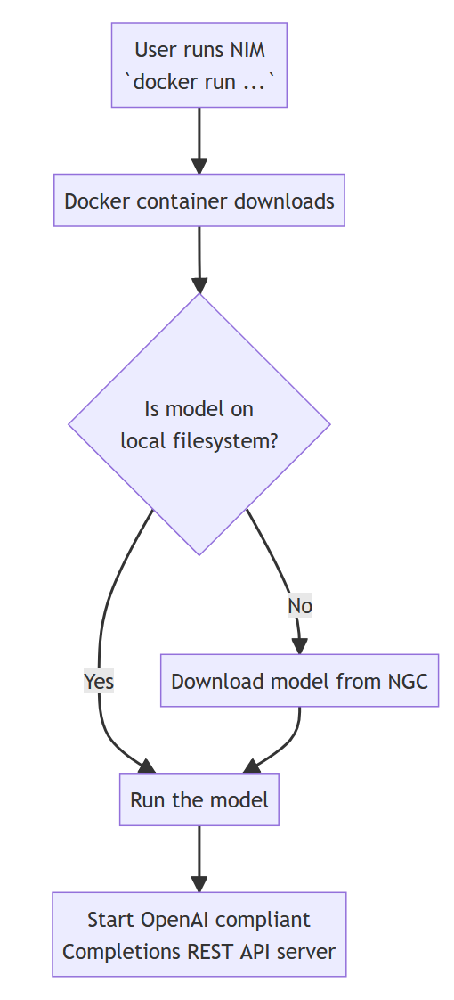
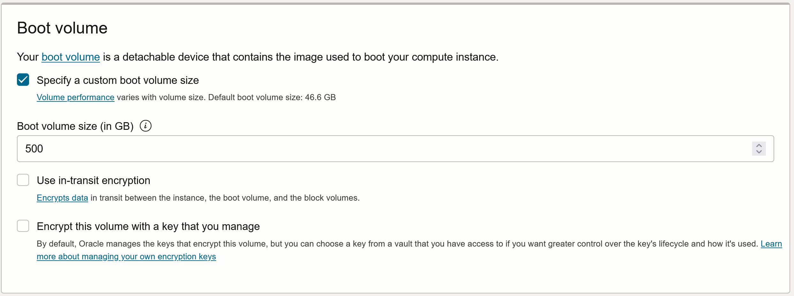
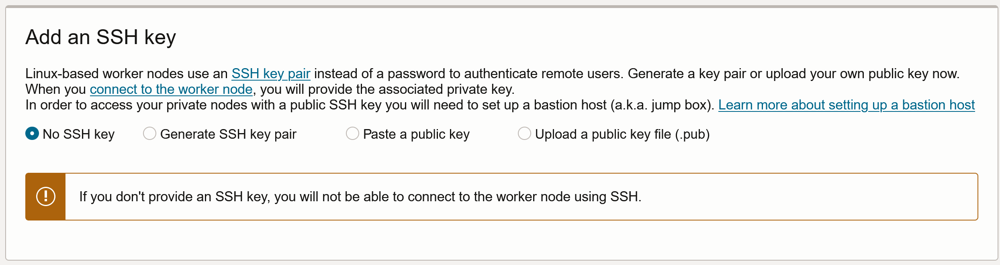
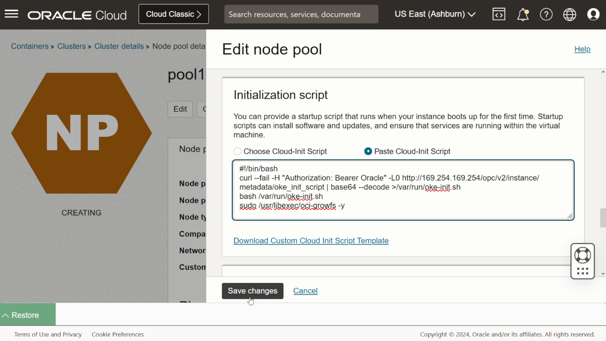
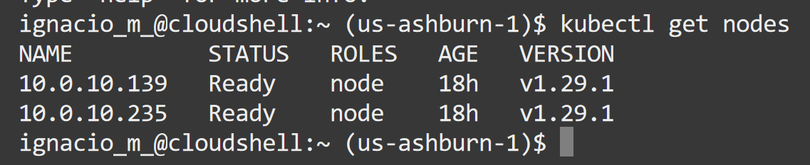
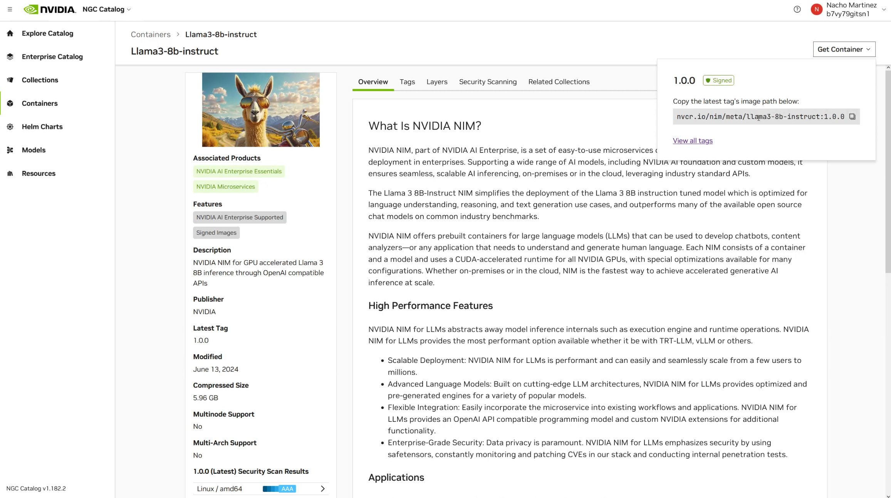
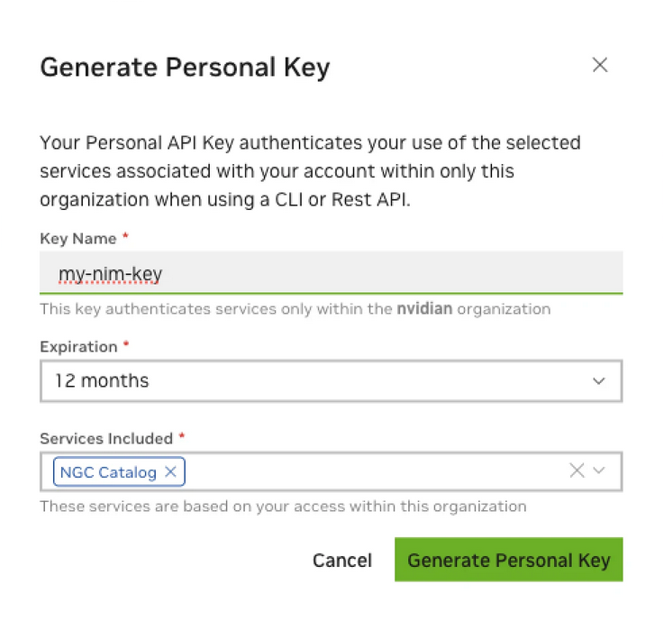
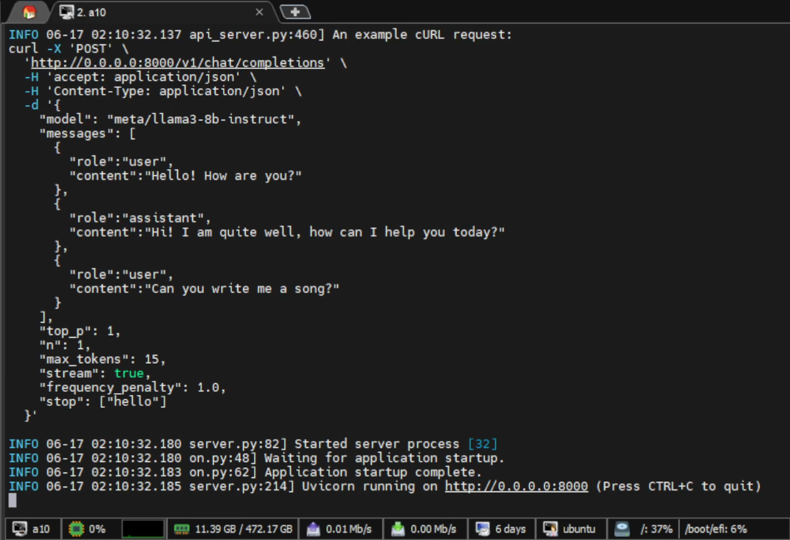
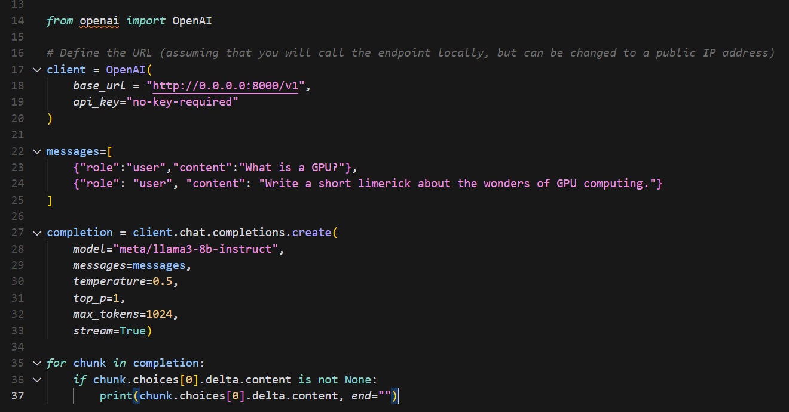
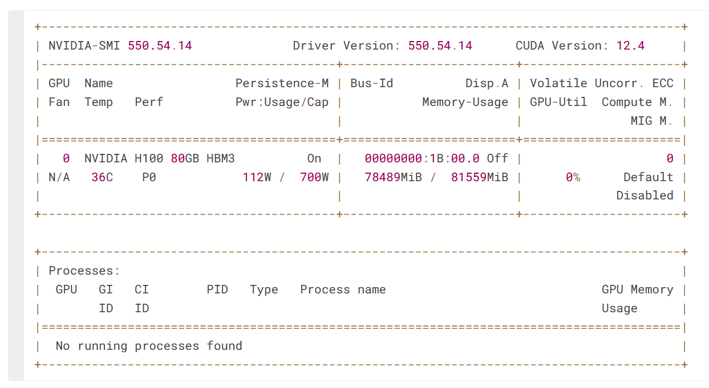

# Getting started with NVIDIA NIM on Oracle Container Engine for Kubernetes (OKE)

[](https://img.shields.io/badge/license-UPL-green)<!--[](https://sonarcloud.io/dashboard?id=oracle-devrel_competency-development-genai)-->

## Introduction

NVIDIA NIM is a set of easy-to-use microservices designed to accelerate the deployment of generative AI models across the cloud, data center, and workstations. NIM packages are categorized by model family and a per model basis. For example, NVIDIA NIM for large language models (LLMs) brings the power of state-of-the-art LLMs to enterprise applications, providing unmatched natural language processing and understanding capabilities.

In this solution, we demonstrate how quickly you can get started with NVIDIA NIM (as a Large Language Model inference framework) and Oracle Container Engine for Kubernetes (as the deployment and orchestration system) on OCI.

NIM makes it easy for IT and DevOps teams to self-host large language models (LLMs) in their own managed environments while still providing developers with industry standard APIs that allow them to build powerful copilots, chatbots, and AI assistants that can transform their business. Leveraging NVIDIA’s cutting-edge GPU acceleration and scalable deployment, NIM offers the fastest path to inference with unparalleled performance.

OCI provides managed Kubernetes, together with some NVIDIA A10 Tensor Core GPUs as Kubernetes nodes, to rapidly accelerate your onboarding into AI. Thanks to NVIDIA NIM, you will be able to explore from a vast collection of models, containers, Helm charts and AI projects in many fields (bioengineering, speech recognition, object detection...), and easily pull these models into your Kubernetes cluster. Following a few steps, you'll be ready to perform inference, invoke and manipulate these models (training, finetuning, testing and using them) in your environment.
The application has the following components:

- Oracle Container Engine for Kubernetes (OKE)
- NVIDIA NIM for inferencing LLMs
- Python code to invoke these inference endpoints

This is an illustration of how NIM works whenever we invoke a supported model on the NVIDIA NGC Catalog:



[You can watch the solution's video here.]()

## 0. Prerequisites and docs

### Prerequisites

- An Oracle Cloud Infrastructure (OCI) Account
- An [NVIDIA AI Enterprise](https://www.nvidia.com/en-us/data-center/products/ai-enterprise/) License
- Access to some NVIDIA **A10** or **A100** Tensor Core GPUs on your OCI tenancy
- An Operating System with `x86_64` architecture compatible with the **NVIDIA Container toolkit**. Find [the available list here.](https://docs.nvidia.com/datacenter/cloud-native/container-toolkit/latest/supported-platforms.html)
- CUDA Drivers installed
- Docker installed

### Docs

- [NVIDIA NIM Introduction](https://docs.nvidia.com/nim/large-language-models/latest/introduction.html)
- [llama-3-8b on NVIDIA NGC Catalog](https://catalog.ngc.nvidia.com/orgs/nim/teams/meta/containers/llama3-8b-instruct)
- [Installing the NVIDIA Container Toolkit](https://docs.nvidia.com/datacenter/cloud-native/container-toolkit/latest/install-guide.html#installing-the-nvidia-container-toolkit)
- [NIM for LLMs - Prerequisites](https://docs.nvidia.com/nim/large-language-models/latest/getting-started.html#ngc-authentication)
- [Arto Bendiken - Alpine CUDA](https://arto.s3.amazonaws.com/notes/cuda)
- [Pulling images from a Private Registry - Kubernetes](https://kubernetes.io/docs/tasks/configure-pod-container/pull-image-private-registry/)
- [OKE Node Resizing for very large container images](https://blogs.oracle.com/ateam/post/oke-node-sizing-for-very-large-container-images)
- [Kubernetes - Setting resource quotas on namespaces](https://kubernetes.io/docs/concepts/policy/resource-quotas/)
- [OCI - cloud-init scripts for OKE](https://docs.oracle.com/en-us/iaas/Content/ContEng/Tasks/contengusingcustomcloudinitscripts.htm)
- [Kubernetes - Unexpected EOF](https://stackoverflow.com/questions/53677592/docker-pull-unexpected-eof)
- [OCI Compute - Microk8s installation for local compute](https://microk8s.io/docs/getting-started)
- [OCI Compute - Microk8s official repository](https://github.com/canonical/microk8s)
- [nim-deploy official repository](https://github.com/NVIDIA/nim-deploy)
- [Launching a NIM with a minimal configuration](https://github.com/NVIDIA/nim-deploy/tree/main/helm)
- [NIM LLMs - Getting started](https://docs.nvidia.com/nim/large-language-models/latest/getting-started.html)
- [NVIDIA NGC CLI - Getting started](https://docs.ngc.nvidia.com/cli/cmd.html)
- [Running Docker inside a container](https://stackoverflow.com/questions/76150514/running-docker-inside-a-container)

## 1. Set up OKE Instance on OCI

First, let's create an OKE instance in our OCI tenancy. To create an OKE Cluster, we can perform this step through the OCI Console:


> Note you can specify whichever GPU shape available in OCI, each node will be created with the selected shape (you can have multiple OKE nodes in the cluster, so be mindful of resource spending.)

Make sure you select a custom boot volume size. For this solution, this is especially important. OKE nodes in a node pool use their boot volume for pod storage. The default size for the boot volume is `46.6GB`. On a typical, Oracle Linux 8 based node, the root filesystem has a capacity around 38GB, and available space for pod images of around 12GB. This, in our case, is not enough, as we'll be operating with Large Language Models, which typically are comprised of several files which can amount up to 100GB-500GB in some extreme cases. Therefore, we need to select a custom boot size during creation:



Also, since we want to change the original boot volume size into something bigger, and we're working with an Oracle Linux Operating System, we shall add an SSH key in advanced options, which will allow us to manually debug and connect to the nodes in our node pool:



And wait for the creation of the cluster, it'll take around 5 minutes.

> You will be able to access this cluster however you want. It's recommended to use OCI Cloud Shell to access and connect to the cluster, as all OCI configuration is performed automatically. If you still want to use a Compute Instance or your own local machine, you will need to set up authentication to your OCI tenancy. Also, you must have downloaded and installed `OCI CLI version 2.24.0` (or later) and configured it for use. If your version of the OCI CLI is earlier than version `2.24.0`, download and install a newer version from here.

## 2. Expand node boot volume sizes with cloud-init

Assuming a typical, Oracle Linux, node instance, what we did during the last step will adjust the boot volume size.

However, the file system will not automatically grow to fill the additional space. In order to fill the additional space, let's change the init script to add a `growfs` command. The default init script for a Oracle Linux node will look something like the following:

```bash
#!/bin/bash
curl --fail -H "Authorization: Bearer Oracle" -L0 http://169.254.169.254/opc/v2/instance/metadata/oke_init_script | base64 --decode >/var/run/oke-init.sh
bash /var/run/oke-init.sh
```

We need to append a line to this script:

```bash
sudo /usr/libexec/oci-growfs -y
```

which will grow the file system to the size we specified during creation. You can do this by editing the node pool itself, after the cluster has been created:



If the nodes are already running before you set the updated init script, simply **cycle** the nodes to get new ones to run the init script. If you don't want to use the init script to run oci-growfs, we can also SSH into each node in the node pool - using the previously inserted SSH key - and insert it manually to run prior to kubelet initialization.

## 3. Access OKE cluster

After the cluster has been provisioned, to get access into the OKE cluster, follow these steps:

1. Click Access Cluster on the `Cluster details` page:

    

2. Accept the default Cloud Shell Access and click Copy to copy the `oci ce cluster create-kubeconfig ...` command.

3. To access the cluster, paste the command into your Cloud Shell session and hit Enter.

4. Verify that the `kubectl` is working by using the `get nodes` command:

    ```bash
    kubectl get nodes
    ```

    

5. Repeat this command multiple times until all nodes show `Ready` in the `STATUS` column:

    When all nodes are `Ready`, the OKE installation has finished successfully.

## 4. Authenticate with NVIDIA NGC



1. Now, we need to authenticate against **NVIDIA NGC**, a portal of services that allows us to download and use LLMs and other types of AI solutions (basically, this is like an LLM and AI catalog, and all related resources (like Helm charts to automatically deploy these)). An **NGC API key** is required to access NGC resources and a key can be generated [in this URL.](https://org.ngc.nvidia.com/setup/personal-keys):

    

    > It is required that permission `NGC Catalog` is enabled on the key.

2. Let's make note of this API as we will use it in the next step, and put it into our **OCI Cloud Shell**, in order to automatically authenticate with NVIDIA's Container Registry (`nvcr`):

    ```bash
    export NGC_API_KEY=<YOUR_API_KEY>
    ```

3. Run the following command to make the environment variable available at startup, every time we launch our **OCI Cloud Shell** instance:

    ```bash
    echo "export NGC_API_KEY=<value>" >> /home/<YOUR_USER>/.bashrc
    ```

    This command will append this line into the end of the `.bashrc` file.

4. Authenticate against `nvcr.io` by running the following command (make sure your environment variable is set on the previous step):

    ```bash
    echo "$NGC_API_KEY" | docker login nvcr.io --username '$oauthtoken' --password-stdin
    ```

Now that our OKE environment has been created, and we're correctly authenticated on NVIDIA's Container Registry, we can deploy the inference server and many other things!

## 5. Deploy the inference server

1. Before we begin with all our K8s resources being created, we shall create a new namespace for our K8s resources:

    ```bash
    kubectl create namespace nim # we create a new namespace for NIM-associated resources
    ```

In this repository, we offer three ways to deploy inference: with Helm, with Kserve, or with Kubernetes directly. Check out their respective directories, `helm/`, `kserve/` and `pod` (for Kubernetes).

### (Recommended) Deploy with Kubernetes with official `nvcr.io` image

1. First, we need to make sure we have access to pull from `nvcr.io`. Note that in file `pod/llama3-pod.yaml`, we reference a secret called `registry-secret`. Let's create the secret with our credentials so Kubernetes knows we have permission to pull the image from `nvcr`:

    ```bash
    kubectl -n nim create secret docker-registry registry-secret --docker-server=nvcr.io --docker-username='$oauthtoken' --docker-password=$NGC_API_KEY
    ```

    > More information on other methods to create a secret [here.](https://kubernetes.io/docs/tasks/configure-pod-container/pull-image-private-registry/)

2. From the file `pod/llama3-pod.yaml`, let's create the pod with K8s:

    ```bash
    # make sure you are on the repository root directory
    kubectl create -f pod/llama3-pod.yaml -n nim
    ```

    Wait until it's running. To check the status of the pod, you can run the following command:

    ```bash
    kubectl get pods -n nim
    ```

    > Note that `pod/llama3-pod.yaml` needs to have privileged mode in the security context, when you're trying to run a docker image inside a Kubernetes pod, as its docs instruct.

3. Wait until it's running, then run `sh` inside it:

    ```bash
    kubectl exec -it docker sh -n nim
    ```

4. Once connected, you will be able to make requests as described in the next chapter.

### Deploy with Kubernetes with fresh `ubuntu` image

1. From the file `pod/ubuntu-pod.yaml`, let's create the pod with K8s:

    ```bash
    # make sure you are on the repository root directory
    kubectl create -f pod/ubuntu-pod.yaml -n nim
    ```

2. Wait until it's running, then run `bash` inside it:

    ```bash
    kubectl exec -it docker bash -n nim
    ```

3. Once connected, we need to install required dependencies. For this, we have prepared `scripts/fresh_ubuntu_install.sh` with all required steps. You need to modify this file to include your NVIDIA NGC API key:

    ```bash
    touch fresh_ubuntu_install.sh # create empty file first
    # paste the contents of the original script
    # change line 8, from:
    export NGC_API_KEY=<YOUR_NVIDIA_NGC_API_KEY>
    # replace it with your API key and save the file.
    ```

4. Change permissions to be able to run the shell script:

    ```bash
    chmod a+x fresh_ubuntu_install.sh
    ```

5. Run the installation script:

    ```bash
    bash fresh_ubuntu_install.sh
    ```

6. After this, a Docker container will be created from the image, and you'll be able to make local requests to the Kubernetes node's public IP address. We will explain inference further in the next chapter.

We have also included an initial script for you to install with the official `docker` and `alpine` images, which are very popular Docker images. However, at the time of writing, NVIDIA Container Toolkit (or NVIDIA drivers as a whole) don't officially support `musl`-based Operating Systems, as their drivers are compiled with `glibc`; while Alpine uses `musl-libc`, part of the reason why the Operating System is so lightweight. If you're particularly interested in these Docker images, check out [this script](scripts/alpine_cuda.txt) which illustrates all steps required to manually compile Alpine-CUDA.

### Deploy with Helm

To perform the deployment of our inference server, we will use `Helm`, a solution that allows us to manage and install Kubernetes applications with configuration files (it's like the Terraform equivalent of Cloud deployments). We will use NVIDIA's official `nim-deploy` repository to perform this deployment.

1. We can launch `llama3-8b-instruct` using a default configuration while only setting the NGC API key and persistence in one line with no extra files. For this, set `persistence.enabled` to `true` to ensure that permissions are set correctly and the container runtime filesystem isn't filled by downloading models:

    ```bash
    # clone the repository
    git clone https://github.com/NVIDIA/nim-deploy.git
    # cd into helm charts directory
    cd helm/
    helm --namespace nim install my-nim nim-llm/ --set model.ngcAPIKey=$NGC_API_KEY --set persistence.enabled=true
    ```

    You can modify the file `helm/nim-llm/values.yaml` to select which model you want to deploy, and many other options (whether you want persistent volumes or you're fine with `ephemeral-storage`, etc.). I have included my own `values.yaml` file as a guidance for those of you trying to replicate.

    > Note we're referencing the environment variable `$NGC_API_KEY` which we set on step 1.6. Make sure the variable is set on your environment before running this installation.,

2. To learn more about this installation (and what got installed where, like the persistence volumes automatically created...), run:

    ```bash
    helm status my-nim
    helm get all my-nim
    ```

3. You can check the status of all pods in the `nim` namespace, to check when it's ready:

    ```bash
    kubectl get pods -n nim
    ```

    > Wait until the status changes to `READY`.

4. Use `kubectl` to see the status of this Helm deployment, and wait until the inference server pods are running (the first pull might take a few minutes). Once the container is created, loading the model also takes a few minutes. You can monitor the pod with these commands:

5. You can check the specific logs of pods, and debug them, with the following commands:

    ```bash
    kubectl describe pods <POD_NAME>
    kubectl logs <POD_NAME>
    ```

Once it's ready, we can begin with **inference** (making requests to the model).

## 6. Run Inference

1. We can check the logs by running the following command:

    ```bash
    helm -n nim test my-nim --logs
    ```

    > This will run some simple inference requests. If the three tests pass, you'll know the deployment was successful. Avoid setting up external ingress without adding an authentication layer. This is because NIM doesn't provide authentication on its own. The chart provides options for basic ingress.

2. To test the inference server on OKE, we need to set up port forwarding on the service (or the pod), so we can try it from an external IP address (outside of the K8s node) and still be able to access the exposed port on the node:

    ```bash
    kubectl -n nim port-forward service/my-nim-nim-llm 8000:8000
    ```

3. Let's make a request to our LLM using `curl`:

    ```bash
    Then try a request:

    curl -X 'POST' \
    'http://localhost:8000/v1/chat/completions' \
    -H 'accept: application/json' \
    -H 'Content-Type: application/json' \
    -d '{
    "messages": [
        {
        "content": "You are a polite and respectful chatbot helping people plan a vacation.",
        "role": "system"
        },
        {
        "content": "What should I do for a 4 day vacation in Spain?",
        "role": "user"
        }
    ],
    "model": "meta/llama3-8b-instruct",
    "max_tokens": 16,
    "top_p": 1,
    "n": 1,
    "stream": false,
    "stop": "\n",
    "frequency_penalty": 0.0
    }'
    ```

    

4. We have also prepared a Python script called `scripts/invoke_llama_3.py` which uses the *OpenAI completions* module to communicate with the model and allows us to automate querying the LLM and receiving responses programatically. To run this script, you will need to create an environment, activate it, install the requirements in `scripts/requirements.txt` and run the application.

    

5. If you don't have a virtual environment, create a new one (you can do this with `conda` too):

    ```bash
    python3 -m venv .demo
    ```

6. Activate the virtual environment we just created:

    ```bash
    source .demo/bin/activate
    ```

7. Install Python requirements into the environment:

    ```bash
    pip install -r scripts/requirements.txt
    ```

8. Run the Python script:

  ```bash
  python scripts/invoke_llama_3.py
  ```

> Make sure to change the IP address where requests are made if you're working with OKE. If you're using OCI Compute, make sure you choose the instance's public IP address or invoke locally.

## 7. (Bonus) NGC CLI

With NVIDIA GPU Cloud (NGC) command-line interface (CLI), you can perform many of the same operations that are available from the NGC website, such as running jobs, viewing Docker repositories and downloading AI models within your organization and team space.

To do this with the CLI, follow these steps:

1. Install the CLI from [this link](https://org.ngc.nvidia.com/setup/installers/cli), or [with this official script for Ubuntu](https://github.com/NVIDIA/nim-deploy/blob/main/helm/nim-llm/files/ngc_pull.sh).

    > Note the mentioned installation script doesn't work on busybox or alpine Linux.

2. The first time that you use the CLI, you must set your configuration. Configure and authenticate with NVIDIA NGC:

    ```bash
    ngc config set
    ```

3. Explore all possible options in the CLI by running the help command:

    ```bash
    ngc -h
    ```

## 7. Conclusions

Using `LLaMA-3` is just one of many examples you can find on the *NVIDIA NGC* catalog. Check out all their solutions in [the official NGC website](https://catalog.ngc.nvidia.com), where you will be able to find:

- **Collections** of solutions, industry solutions and use cases from several publishers, in all AI fields, including video analytics, speech recognition and transcription, protein structure folding (bioengineering), and much more.
- A collection of **containers** for AI/ML, the metaverse and HPC-related workloads
- **Helm Charts** to easily deploy the deployment of software, like the NVIDIA GPU Operator, on Kubernetes clusters.
- **Pre-trained models** on Computer Vision, Speech recognition and transcription, NLP, Drug discovery, TTS...
- Lots of **resources** and documentation for you to get started.

Get started today developing on OCI and NVIDIA with these tools!

## Annex: OCI Compute: Install NVIDIA Container Toolkit

If you're planning on running any NIM solution directly into an OCI Compute instead of OKE, you will need to set up the NVIDIA Container Toolkit in your environment (wherever you're planning on launching these Docker images), as the images will run with the NVIDIA Docker runtime.

1. Configure the production repository:

    ```bash
    curl -fsSL https://nvidia.github.io/libnvidia-container/gpgkey | sudo gpg --dearmor -o /usr/share/keyrings/nvidia-container-toolkit-keyring.gpg && curl -s -L https://nvidia.github.io/libnvidia-container/stable/deb/nvidia-container-toolkit.list | sed 's#deb https://#deb [signed-by=/usr/share/keyrings/nvidia-container-toolkit-keyring.gpg] https://#g' | sudo tee /etc/apt/sources.list.d/nvidia-container-toolkit.list
    ```

2. Update packages list from repository and install the NVIDIA Container Toolkit required packages:

    ```bash
    sudo apt-get update -y && sudo apt-get install -y nvidia-container-toolkit
    ```

3. Configure Docker's container runtime and restart the Docker daemon:

    ```bash
    sudo nvidia-ctk runtime configure --runtime=docker
    sudo systemctl restart docker
    ```

    > The `nvidia-ctk` command modifies the /etc/docker/daemon.json file on the host. The file is updated so that Docker can use the NVIDIA Container Runtime.

4. To ensure things are working, run the following command:

    ```bash
    docker run --rm --runtime=nvidia --gpus all ubuntu nvidia-smi
    ```

    > This will produce an output for your own system, where you can confirm CUDA driver version, and available GPUs:

    

5. Now that we have the proper runtime installed, we can either authenticate with our OKE cluster as described in chapter 3.1. However, if you have decided to only use OCI Compute for this solution and not Kubernetes, you can emulate a Kubernetes cluster with `microk8s`.

    To install microk8s, run:

    ```bash
    sudo snap install microk8s --classic
    ```

    Join the `microk8s` group with your current user:

    ```bash
    sudo usermod -a -G microk8s $USER
    mkdir -p ~/.kube
    chmod 0700 ~/.kube
    ```

    Restart your shell and check the status of microk8s:

    ```bash
    microk8s kubectl get nodes
    ```

6. From here, now that `microk8s` is installed in your OCI Compute instance, proceed to **chapter 5** to continue with deploying your Docker images within a Kubernetes pod.

## Contributing

<!-- If your project has specific contribution requirements, update the
    CONTRIBUTING.md file to ensure those requirements are clearly explained. -->

This project welcomes contributions from the community. Before submitting a pull
request, please [review our contribution guide](./CONTRIBUTING.md).

## Security

Please consult the [security guide](./SECURITY.md) for our responsible security
vulnerability disclosure process.

## License

Copyright (c) 2024 Oracle and/or its affiliates.

Licensed under the Universal Permissive License (UPL), Version 1.0.

See [LICENSE](LICENSE.txt) for more details.

ORACLE AND ITS AFFILIATES DO NOT PROVIDE ANY WARRANTY WHATSOEVER, EXPRESS OR IMPLIED, FOR ANY SOFTWARE, MATERIAL OR CONTENT OF ANY KIND CONTAINED OR PRODUCED WITHIN THIS REPOSITORY, AND IN PARTICULAR SPECIFICALLY DISCLAIM ANY AND ALL IMPLIED WARRANTIES OF TITLE, NON-INFRINGEMENT, MERCHANTABILITY, AND FITNESS FOR A PARTICULAR PURPOSE.  FURTHERMORE, ORACLE AND ITS AFFILIATES DO NOT REPRESENT THAT ANY CUSTOMARY SECURITY REVIEW HAS BEEN PERFORMED WITH RESPECT TO ANY SOFTWARE, MATERIAL OR CONTENT CONTAINED OR PRODUCED WITHIN THIS REPOSITORY. IN ADDITION, AND WITHOUT LIMITING THE FOREGOING, THIRD PARTIES MAY HAVE POSTED SOFTWARE, MATERIAL OR CONTENT TO THIS REPOSITORY WITHOUT ANY REVIEW. USE AT YOUR OWN RISK.
