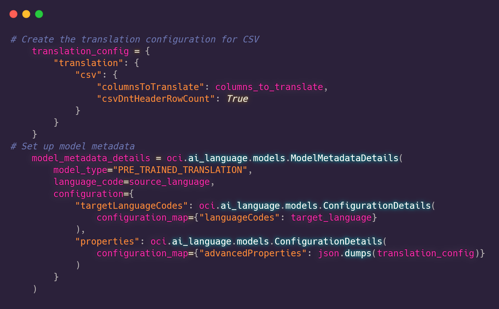
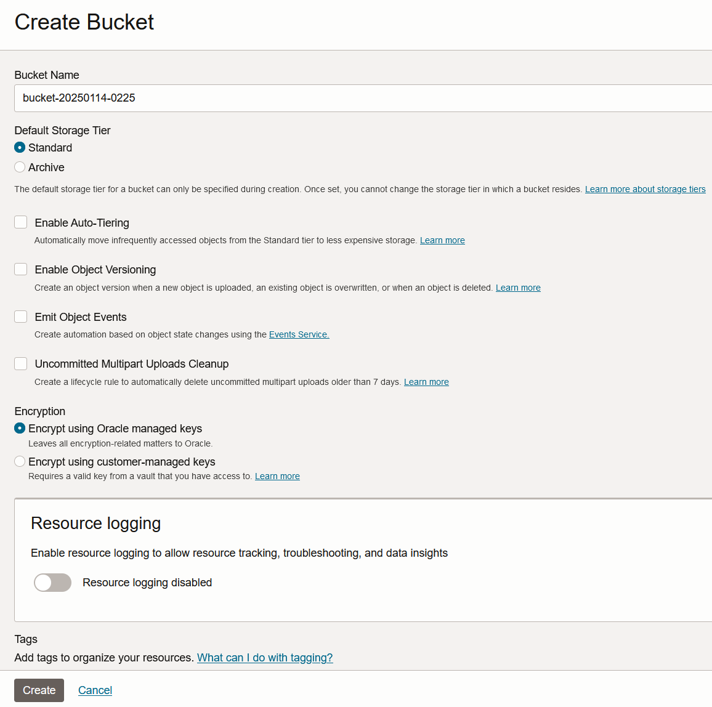
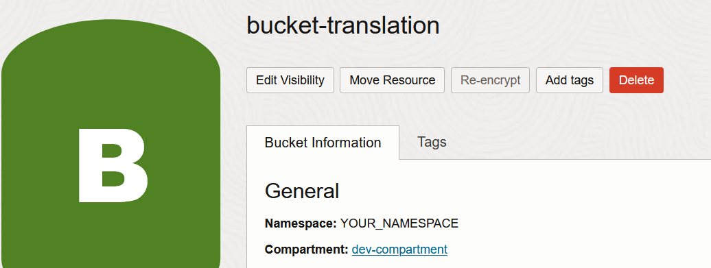
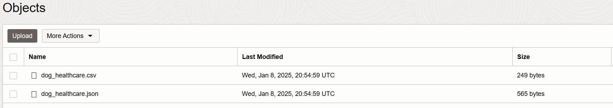
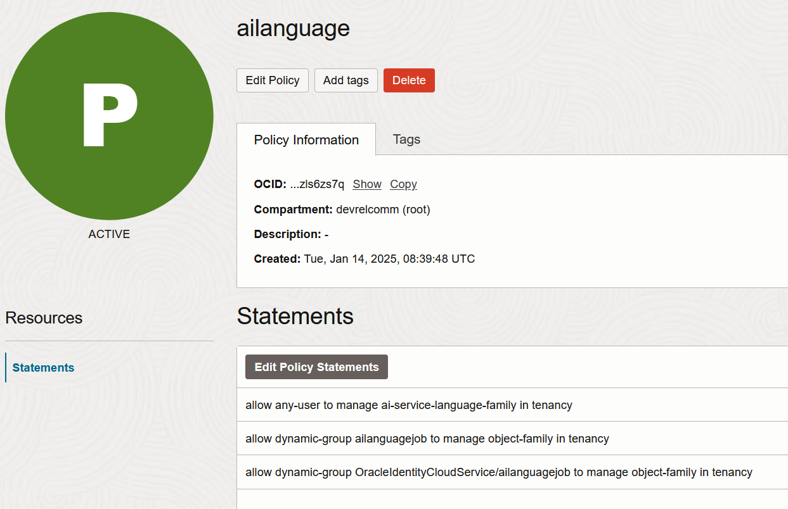
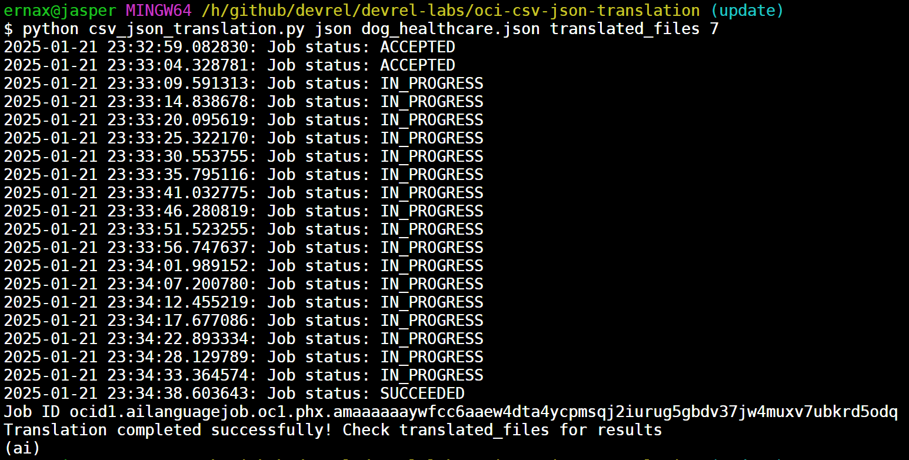
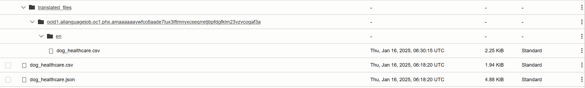
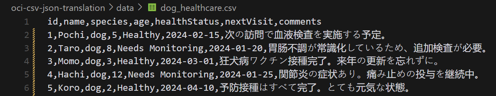
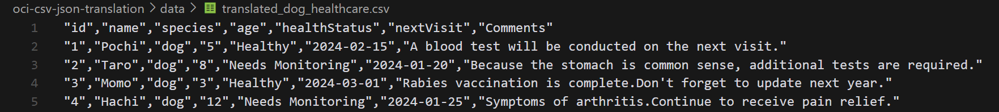

# Translating CSV/JSON Files with OCI Language

## Introduction

There have been significant improvements in the world of language translation with the advancements of AI. With the advancement of Large Language Models (LLMs), we can now achieve language translation much easier than we did before.

In this solution, we will use OCI Language to enable the selective translation of specific columns in CSV files or keys in CSV or JSON documents, while preserving the original structure of the file. This use case is particularly useful for localizing data files while maintaining their format and untranslated fields.

The following OCI Services are present in this solution:
- **OCI Language** for document/field translation
- **OCI Compute** or **OCI Cloud Shell** for easily running the code present in this solution's repository, having authenticated this machine with the OCI SDK.

We will use the OCI Python Source Development Kit to allow a customizable translation experience for CSV and JSON documents:



## 0. Prerequisites and setup

### Prerequisites

- Python 3.8 or higher
- OCI Account with Language Translation service enabled
- Required IAM Policies and Permissions for async jobs
- Object Storage bucket for input/output files
- OCI CLI configured with proper credentials

### Docs

- [ISO Language Codes](https://en.wikipedia.org/wiki/List_of_ISO_639_language_codes)
- [OCI SDK](https://docs.oracle.com/en-us/iaas/Content/API/Concepts/sdkconfig.htm)
- [Async Job Policies on IAM](https://docs.oracle.com/en-us/iaas/language/using/policies-async-jobs.htm)
- [OCI Document Translation](https://docs.oracle.com/en-us/iaas/language/using/translate-document.htm#translate-document)
- [List of Supported Languages in OCI Language](https://docs.oracle.com/en-us/iaas/language/using/translate.htm#supported-langs)
- [List of Supported Document Types in OCI Document Translation](https://docs.oracle.com/en-us/iaas/language/using/translate-document.htm#doc-types)

### Setup

1. Create an OCI account
2. Enable the Language Translation service in your tenancy if you haven't already
3. Set up OCI CLI and create API keys:

   ```bash
   # Install OCI CLI
   bash -c "$(curl -L https://raw.githubusercontent.com/oracle/oci-cli/master/scripts/install/install.sh)"
   
   # Configure OCI CLI (this will create ~/.oci/config)
   oci setup config
   ```

4. Set up the appropriate IAM policies to use the service if you haven't ([see this link for more information](https://docs.oracle.com/en-us/iaas/language/using/policies.htm)).

5. Create a bucket in OCI Object Storage, where we'll put the file we want to translate:

   

6. Take note of the Object Storage namespace containing the bucket(visible in the OCI Console under Object Storage), as you will need to add it to your `config.yaml`:

   

7. Upload the documents you want translated to the source bucket:

   

   > **Note**: you can find the list of supported document types and extensions for the translation service [here.](https://docs.oracle.com/en-us/iaas/language/using/translate-document.htm#doc-types) 

8. Set up an additional IAM policy to allow all OCI Language resources to access and read the bucket. For that, you will need to create a dynamic group, associate all OCI Language resources to that dynamic group, and give permissions to the dynamic group to read the bucket you created in the previous step. [(More info on this link)](https://docs.oracle.com/en-us/iaas/language/using/policies-async-jobs.htm)

   First, we create the dynamic group: 

   

   Now, we create the policy:

   

   Note that, depending on your Identity Domain, you will need to preprend the name of your Identity Domain to the group name, as demonstrated in the third policy in the image above.

## 1. Getting Started

1. Clone this repository:

   ```bash
   git clone https://github.com/oracle-devrel/devrel-labs.git
   cd oci-csv-json-translation
   ```

2. Install required dependencies:

   ```bash
   pip install -r requirements.txt
   ```

3. Update `config.yaml` with your settings:

   ```yaml
   # Language Translation Service Configuration
   language_translation:
     compartment_id: "ocid1.compartment.oc1..your-compartment-id"
     source_language: "en"  # ISO language code, refer to the Docs for all supported languages & codes
     target_language: "es"  # ISO language code

   # Object Storage Configuration # the bucket's information that will contain input & output documents
   object_storage:
     namespace: "your-namespace"  # Your tenancy's Object Storage namespace
     bucket_name: "your-bucket-name"  # Bucket for CSV/JSON translations
   ```

4. Run the translation:

   ```bash
   # note the input file refers to the contents of the Object Storage bucket, not local files
   # For CSV files (column numbers start counting from 1, not 0)
   python csv_json_translation.py csv input.csv output.csv 1 2 3 

   # For JSON files
   python csv_json_translation.py json input.json output.json key1 key2
   ```

## Usage Examples

### CSV Translation

```bash
# Translate columns 1, 3, and 5 from English to Spanish, and put it into the translated_files dir
python csv_json_translation.py csv products.csv translated_files 1 3 5
```

In my case, with the sample files in [the data directory](./data/), it would be something like:

```bash
python csv_json_translation.py csv dog_healthcare.csv translated_files 7
```

### JSON Translation

```bash
# Translate 'name' and 'details' fields in a JSON file
python csv_json_translation.py json catalog.json catalog_es.json name details
```



When the translation job is done, we'll be able to have a look at the translated document(s) in our Object Storage bucket:



For example, with the CSV file, it translated only the comments column as I specified, from this:



To this:



## Annex: Configuration

The project uses three types of configuration:

1. **OCI Configuration** (`~/.oci/config`):
   - Created automatically by `oci setup config`
   - Contains your OCI authentication details
   - Used for API authentication

2. **Translation Configuration** (`config.yaml`):
   ```yaml
   # Language Translation Service Configuration
   language_translation:
     compartment_id: "ocid1.compartment.oc1..your-compartment-id"
     source_language: "en"
     target_language: "es"

   # Object Storage Configuration
   object_storage:
     namespace: "your-namespace"
     bucket_name: "your-bucket-name"
   ```

3. **Environment Variables** (optional, override config.yaml):
   - `OCI_COMPARTMENT_ID`: Your OCI compartment OCID
   - `OCI_SOURCE_LANG`: Source language code
   - `OCI_TARGET_LANG`: Target language code

### Configuration Priority

The configuration values are loaded in the following priority order:
1. Environment variables (if set)
2. Values from config.yaml
3. Default values (for language codes only: en -> es)

## Supported Languages

The service supports a wide range of languages. Common language codes include:
- English (en)
- Spanish (es)
- French (fr)
- German (de)
- Italian (it)
- Portuguese (pt)
- Chinese Simplified (zh-CN)
- Japanese (ja)

For a complete list of supported languages, refer to [the OCI Documentation](https://docs.oracle.com/en-us/iaas/language/using/translate.htm#supported-langs).

## Contributing

This project is open source. Please submit your contributions by forking this repository and submitting a pull request! Oracle appreciates any contributions that are made by the open source community.

## License

Copyright (c) 2024 Oracle and/or its affiliates.

Licensed under the Universal Permissive License (UPL), Version 1.0.

See [LICENSE](../LICENSE) for more details.

ORACLE AND ITS AFFILIATES DO NOT PROVIDE ANY WARRANTY WHATSOEVER, EXPRESS OR IMPLIED, FOR ANY SOFTWARE, MATERIAL OR CONTENT OF ANY KIND CONTAINED OR PRODUCED WITHIN THIS REPOSITORY, AND IN PARTICULAR SPECIFICALLY DISCLAIM ANY AND ALL IMPLIED WARRANTIES OF TITLE, NON-INFRINGEMENT, MERCHANTABILITY, AND FITNESS FOR A PARTICULAR PURPOSE. FURTHERMORE, ORACLE AND ITS AFFILIATES DO NOT REPRESENT THAT ANY CUSTOMARY SECURITY REVIEW HAS BEEN PERFORMED WITH RESPECT TO ANY SOFTWARE, MATERIAL OR CONTENT CONTAINED OR PRODUCED WITHIN THIS REPOSITORY. IN ADDITION, AND WITHOUT LIMITING THE FOREGOING, THIRD PARTIES MAY HAVE POSTED SOFTWARE, MATERIAL OR CONTENT TO THIS REPOSITORY WITHOUT ANY REVIEW. USE AT YOUR OWN RISK.