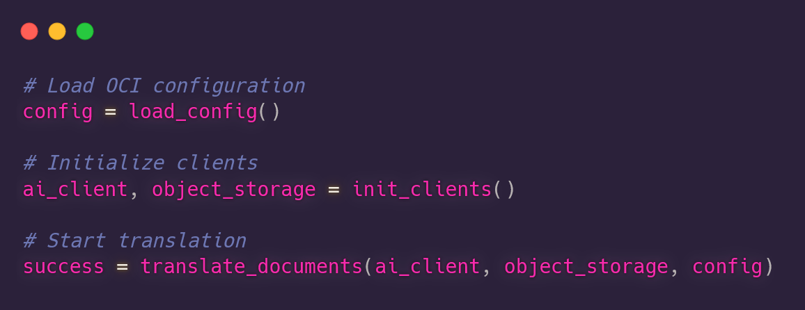
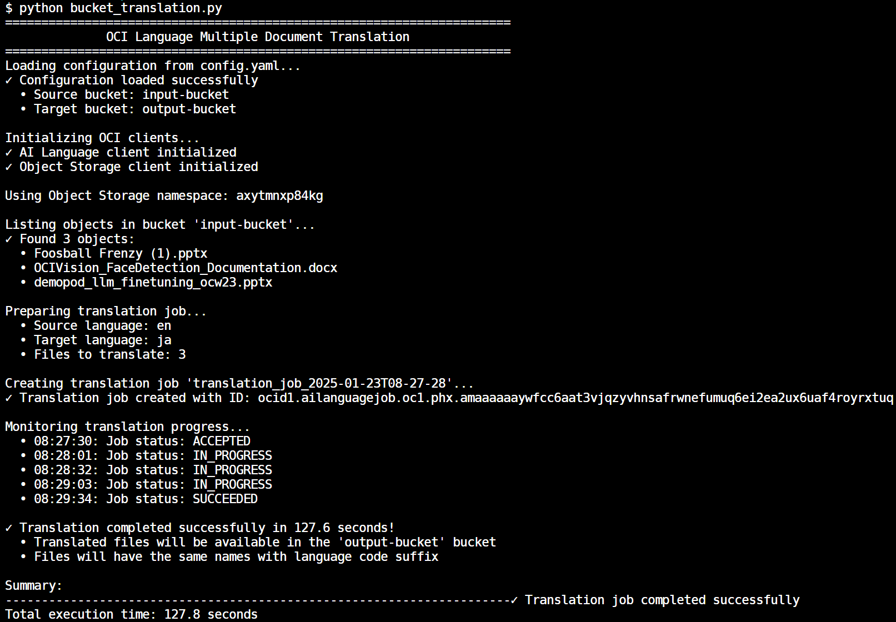
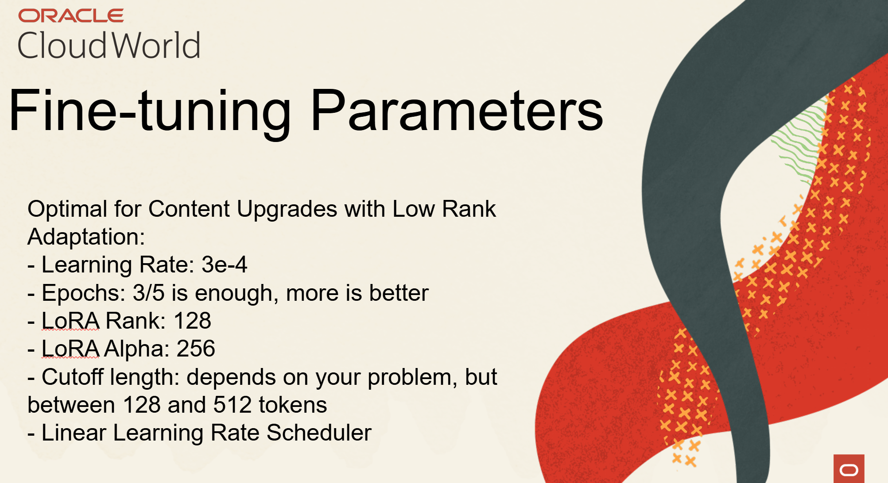
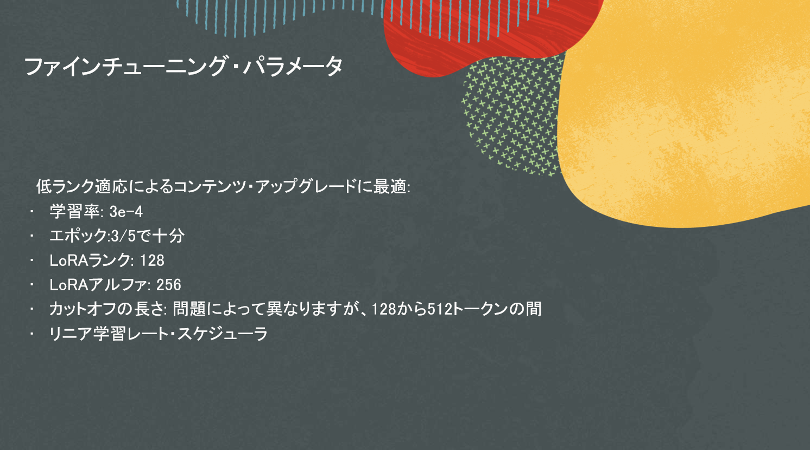
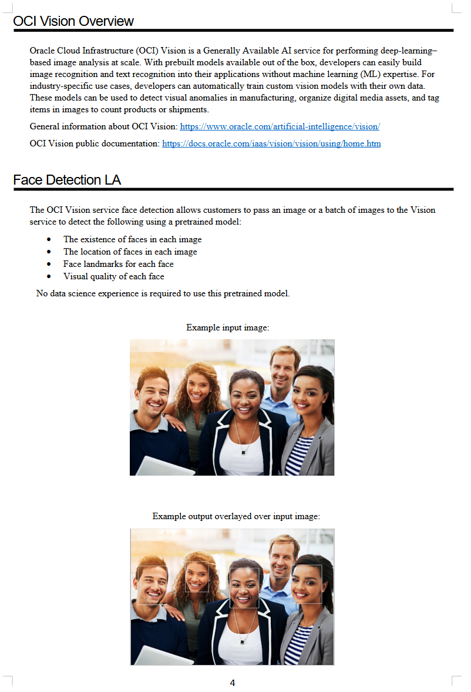
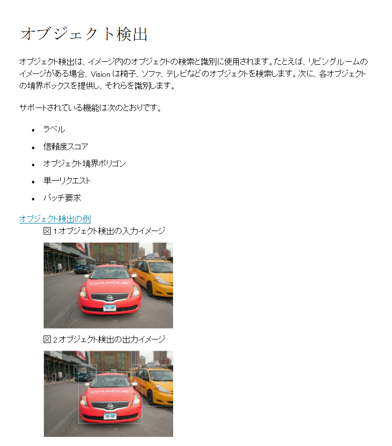

# OCI Multiple Document Translation

## Introduction

Language translation has been revolutionized by artificial intelligence, particularly through the development of Large Language Models (LLMs). These models have dramatically simplified and enhanced our ability to translate between languages compared to earlier methods.

This solution aims to automate the translation of multiple documents that have been previously stored in an OCI Object Storage bucket. For instance, a company is working on an open-source collaborative project with multiple people from all over the world; the documentation and instructions can be translated to all languages and allow developers from all over the world from contributing.

It's also particularly useful for companies handling worldwide customer support, where documents, conversations and reports need to be quickly translated into multiple languages to serve a global user base.

These documents can be anything from HTML documents (translating whole websites), to JSON, CSV/TSV, TXT, DOCX, PPTX, XLSX, and more formats.

This solution supports various document formats and maintains the original file structure in the target bucket, making it ideal for bulk document translation tasks.



## 0. Prerequisites and setup

### Prerequisites

- Python 3.8 or higher
- OCI Account with Language Translation service enabled
- Required IAM Policies and Permissions for async jobs
- Source and target Object Storage buckets
- OCI CLI configured with proper credentials

### Docs

- [ISO Language Codes](https://en.wikipedia.org/wiki/List_of_ISO_639_language_codes)
- [OCI SDK](https://docs.oracle.com/en-us/iaas/Content/API/Concepts/sdkconfig.htm)
- [Async Job Policies on IAM](https://docs.oracle.com/en-us/iaas/language/using/policies-async-jobs.htm)
- [OCI Document Translation](https://docs.oracle.com/en-us/iaas/language/using/translate-document.htm#translate-document)
- [List of Supported Languages in OCI Language](https://docs.oracle.com/en-us/iaas/language/using/translate.htm#supported-langs)

### Setup

1. Create an OCI account if you don't have one
2. Enable Language Translation service in your tenancy
3. Set up OCI CLI and create API keys:

   ```bash
   # Install OCI CLI
   bash -c "$(curl -L https://raw.githubusercontent.com/oracle/oci-cli/master/scripts/install/install.sh)"
   
   # Configure OCI CLI (this will create ~/.oci/config)
   oci setup config
   ```

4. Set up the appropriate IAM policies to use the OCI Language service ([see this link for more information](https://docs.oracle.com/en-us/iaas/language/using/policies.htm)).

5. Create source and target buckets in OCI Object Storage:

   

   After we've created these buckets, we're ready to upload documents to the source bucket.

6. Take note of the Object Storage namespace containing the bucket(visible in the OCI Console under Object Storage), as you will need to add it to your `config.yaml`:

   

7. Upload the documents you want translated to the source bucket:

   

   > **Note**: you can find the list of supported document types and extensions for the translation service [here.](https://docs.oracle.com/en-us/iaas/language/using/translate-document.htm#doc-types) 
   
8. Set up an additional IAM policy to allow all OCI Language resources to access and read the bucket. You will need to create a dynamic group, associate all OCI Language resources to that dynamic group, and give permissions to the dynamic group to read the bucket you created in the previous step. [(More info on this link)](https://docs.oracle.com/en-us/iaas/language/using/policies-async-jobs.htm)

   First, we create the dynamic group: 

   

   Now, we create the policy:

   

   Note that, depending on your Identity Domain, you will need to preprend the name of your Identity Domain to the group name, as demonstrated in the third policy in the image above.

### Docs

- [ISO Language Codes](https://en.wikipedia.org/wiki/List_of_ISO_639_language_codes)
- [OCI SDK](https://docs.oracle.com/en-us/iaas/Content/API/Concepts/sdkconfig.htm)
- [Document Translation](https://docs.oracle.com/en-us/iaas/language/using/translate-document.htm#translate-document)
- [List of Supported Languages in OCI Language](https://docs.oracle.com/en-us/iaas/language/using/translate.htm#supported-langs)
- [List of Supported Document Types in OCI Document Translation](https://docs.oracle.com/en-us/iaas/language/using/translate-document.htm#doc-types)

## 1. Getting Started

1. Clone this repository:

   ```bash
   git clone https://github.com/oracle-devrel/devrel-labs.git
   cd oci-language-multiple-translation
   ```

2. Install required dependencies:

   ```bash
   pip install -r requirements.txt
   ```

3. Update `config.yaml` with your settings:

   ```yaml
   # Language Translation Service Configuration
   language_translation:
     compartment_id: "ocid1.compartment.oc1..your-compartment-id"
     source_bucket: "source-bucket-name"
     target_bucket: "target-bucket-name"
     source_language: "en"  # ISO language code
     target_language: "es"  # ISO language code
   ```

4. Run the translation:

   ```bash
   python bucket_translation.py
   ```

You should get a detailed report of the whole process:



## 2. Results

My files have been translated to my target language wholly. For example, in my PPT presentation, all elements of the presentation keep their same structure, and the text elements change. Take a look at the following comparisons between the original and translated documents:

### PowerPoint Presentations





### Microsoft Word Documents





## Configuration

The project uses two types of configuration:

1. **OCI Configuration** (`~/.oci/config`):
   - Created automatically by `oci setup config`
   - Contains your OCI authentication details
   - Used for API authentication

2. **Translation Configuration** (`config.yaml`):

   ```yaml
   language_translation:
     compartment_id: "ocid1.compartment.oc1..your-compartment-id"
     source_bucket: "source-bucket-name"
     target_bucket: "target-bucket-name"
     source_language: "en"
     target_language: "es"
   ```

## Annex: Supported Languages

| Language | Language Code |
|----------|------|
| Arabic | ar |
| Croatian | hr |
| Czech | cs |
| Danish | da |
| Dutch | nl |
| English | en |
| Finnish | fi |
| French | fr |
| French Canadian | fr-CA |
| German | de |
| Greek | el |
| Hebrew | he |
| Hungarian | hu |
| Italian | it |
| Japanese | ja |
| Korean | ko |
| Norwegian | no |
| Polish | pl |
| Portuguese | pt |
| Portuguese Brazilian | pt-BR |
| Romanian | ro |
| Russian | ru |
| Simplified Chinese | zh-CN |
| Slovak | sk |
| Slovenian | sl |
| Spanish | es |
| Swedish | sv |
| Thai | th |
| Traditional Chinese | zh-TW |
| Turkish | tr |
| Vietnamese | vi |

For an updated list of supported languages, refer to [the OCI Documentation](https://docs.oracle.com/en-us/iaas/language/using/translate.htm#supported-langs).

## Error Handling

The tool includes comprehensive error handling:
- Configuration validation
- Service availability checks
- File format validation
- Translation status monitoring

## Contributing

This project is open source. Please submit your contributions by forking this repository and submitting a pull request! Oracle appreciates any contributions that are made by the open source community.

## License

Copyright (c) 2024 Oracle and/or its affiliates.

Licensed under the Universal Permissive License (UPL), Version 1.0.

See [LICENSE](../LICENSE) for more details.

ORACLE AND ITS AFFILIATES DO NOT PROVIDE ANY WARRANTY WHATSOEVER, EXPRESS OR IMPLIED, FOR ANY SOFTWARE, MATERIAL OR CONTENT OF ANY KIND CONTAINED OR PRODUCED WITHIN THIS REPOSITORY, AND IN PARTICULAR SPECIFICALLY DISCLAIM ANY AND ALL IMPLIED WARRANTIES OF TITLE, NON-INFRINGEMENT, MERCHANTABILITY, AND FITNESS FOR A PARTICULAR PURPOSE. FURTHERMORE, ORACLE AND ITS AFFILIATES DO NOT REPRESENT THAT ANY CUSTOMARY SECURITY REVIEW HAS BEEN PERFORMED WITH RESPECT TO ANY SOFTWARE, MATERIAL OR CONTENT CONTAINED OR PRODUCED WITHIN THIS REPOSITORY. IN ADDITION, AND WITHOUT LIMITING THE FOREGOING, THIRD PARTIES MAY HAVE POSTED SOFTWARE, MATERIAL OR CONTENT TO THIS REPOSITORY WITHOUT ANY REVIEW. USE AT YOUR OWN RISK.