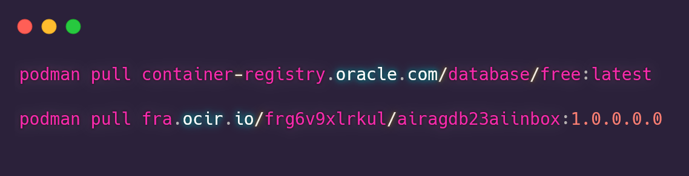

# AI RAG in a BOX Demo using Oracle Autonomous Database 23ai and Local LLMs

## Introduction

An innovative RAG (Retrieval Augmented Generation) system designed to leverage an LLM agent for effective information retrieval and response generation.

This system efficiently processes various document formats and intelligently selects the appropriate knowledge base based on user queries.

The AI RAG in a BOX Demo utilizing the Internal LLM Engine "Ollama" is deployable via Podman across multiple platforms, including Mac OSX, Windows, and Linux.

AI RAG in a BOX Demo using Internal LLM Engine "Ollama" can be deployed in Podman on your PC - Mac OSX (Intel or ARM), Windows (Intel or ARM), or Linux.

This solution includes 2 containers:
- Oracle Database 23ai
- AIRAG Container



## 1. Install the containers

#### Windows Deployment

1. Install Podman in Windows
   - Follow the installation guide [here](https://github.com/containers/podman/blob/main/docs/tutorials/podman-for-windows.md)
   - See detailed tutorial for [Windows Installation](./install_win_llama3_db23ai.md)

2. Install Containers
   - Deploy using the script: [install_airagdb23ai_win.bat](./scripts/install_airagdb23ai_win.bat)

#### Mac OSX Deployment

- Deploy using the script. You can check all the steps which are commented in the script: [install_airagdb23ai_macosx.sh](./scripts/install_airagdb23ai_macosx.sh)

#### Linux Deployment

- Deploy using the script: [install_airagdb23ai_linux.sh](./scripts/install_airagdb23ai_linux.sh)

## 2.Verifying Installation

1. Check Podman network:

```bash
podman network ls
```

2. Verify downloaded images:

```bash
podman images
```

3. Check running containers:

```bash
podman ps
```

4. Check container logs:

```bash
podman logs -f 23aidb
podman logs -f airagdb23aiinbox
```

5. Connect to the database:

```bash
podman exec -it 23aidb sqlplus VECDEMO/<pwd>@FREEPDB1
```

## Appendix: Troubleshooting

### Database Connection

To verify database functionality for the user `VECDEMO`:

```bash
podman exec -it 23aidb sqlplus VECDEMO/<pwd>@FREEPDB1
```

### HuggingFace Embeddings Error

If you encounter this error:

```bash
OSError: We couldn't connect to 'https://huggingface.co' to load this file...
```

Restart the container:

```bash
podman stop airagdb23aiinbox
podman start airagdb23aiinbox
```

## Contributing

This project is open source. Please submit your contributions by forking this repository and submitting a pull request! Oracle appreciates any contributions that are made by the open source community.

## License

Copyright (c) 2024 Oracle and/or its affiliates.

Licensed under the Universal Permissive License (UPL), Version 1.0.

See [LICENSE](../LICENSE) for more details.

ORACLE AND ITS AFFILIATES DO NOT PROVIDE ANY WARRANTY WHATSOEVER, EXPRESS OR IMPLIED, FOR ANY SOFTWARE, MATERIAL OR CONTENT OF ANY KIND CONTAINED OR PRODUCED WITHIN THIS REPOSITORY, AND IN PARTICULAR SPECIFICALLY DISCLAIM ANY AND ALL IMPLIED WARRANTIES OF TITLE, NON-INFRINGEMENT, MERCHANTABILITY, AND FITNESS FOR A PARTICULAR PURPOSE. FURTHERMORE, ORACLE AND ITS AFFILIATES DO NOT REPRESENT THAT ANY CUSTOMARY SECURITY REVIEW HAS BEEN PERFORMED WITH RESPECT TO ANY SOFTWARE, MATERIAL OR CONTENT CONTAINED OR PRODUCED WITHIN THIS REPOSITORY. IN ADDITION, AND WITHOUT LIMITING THE FOREGOING, THIRD PARTIES MAY HAVE POSTED SOFTWARE, MATERIAL OR CONTENT TO THIS REPOSITORY WITHOUT ANY REVIEW. USE AT YOUR OWN RISK.