# Podman Installation in Windows 

Here you can see the tutorial to install **Podman Desktop** in Windows.

## Steps

1. Podman Desktop Installation

    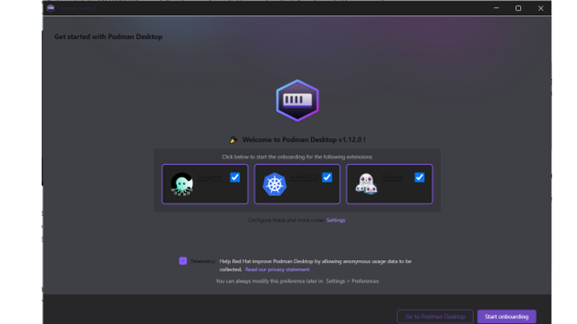

2. Click on SETUP

    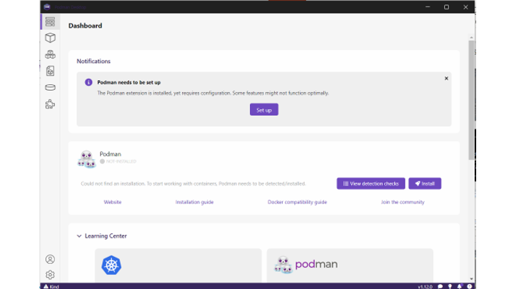

3. Execute DISM

    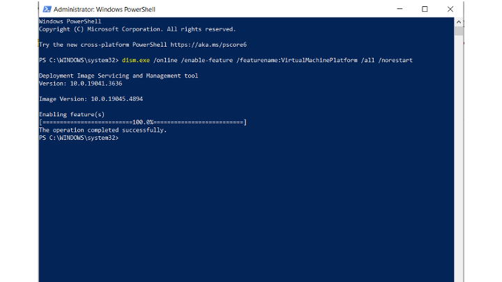

    ```bash
    dism.exe /online /enable-feature /featurename:VirtualMachinePlatform /all /norestart
    ```

4. Execute PODMAN Setup

    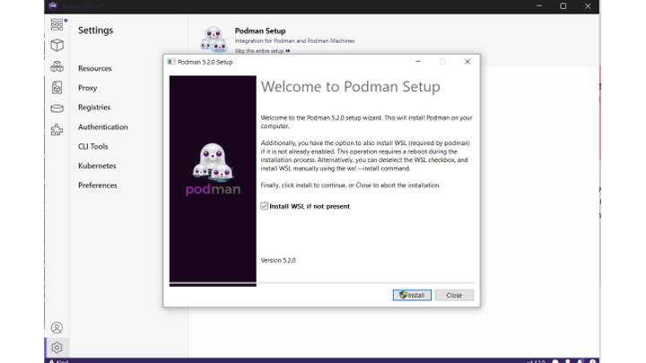

5. Check if containers are running

    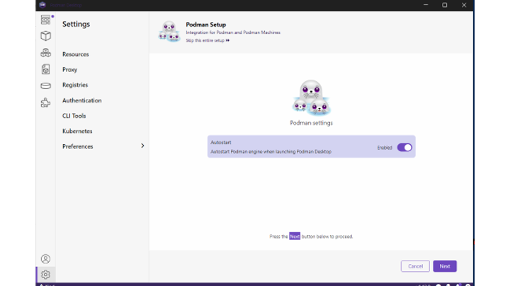

6. PODMAN Setup in execution

    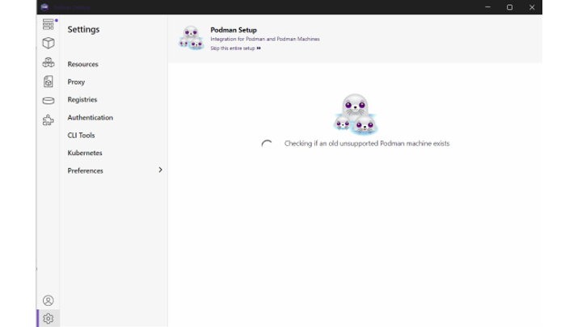

7. Check PODMAN Setup 

    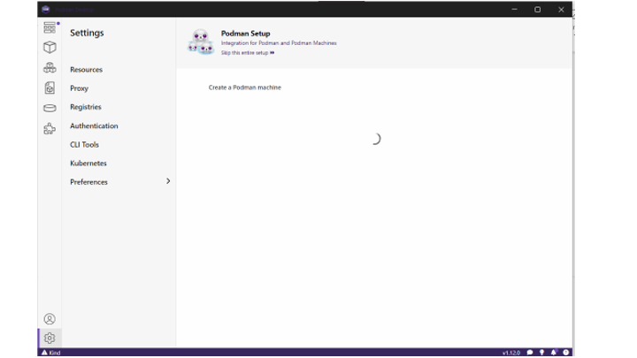

8. Check PODMAN Installation.

    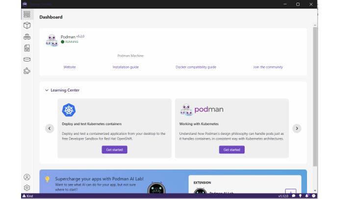

9. Execute podman commands 

    ```bash
    # Check if containers are running
    podman ps

    # Check if images are downloaded
    podman images
    ```

10. Download the images from OCI Repository for x86:

    ```bash
    # Pull the images from OCI Repository
    podman pull container-registry.oracle.com/database/free:latest

    # Pull the images from OCI Repository
    podman pull fra.ocir.io/frg6v9xlrkul/airagdb23aiinbox:1.0.0.0.0
    ```

    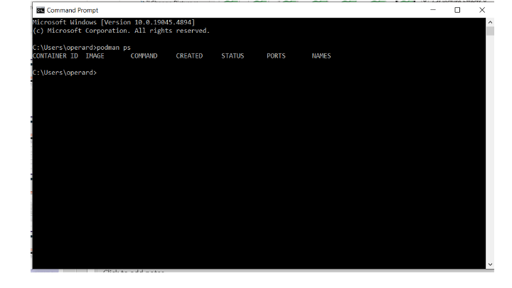

11. Check log of container installation.

    You can check the log during the DB23ai Container Installation:

    ```bash
    podman logs -f 23aidb
    ```

    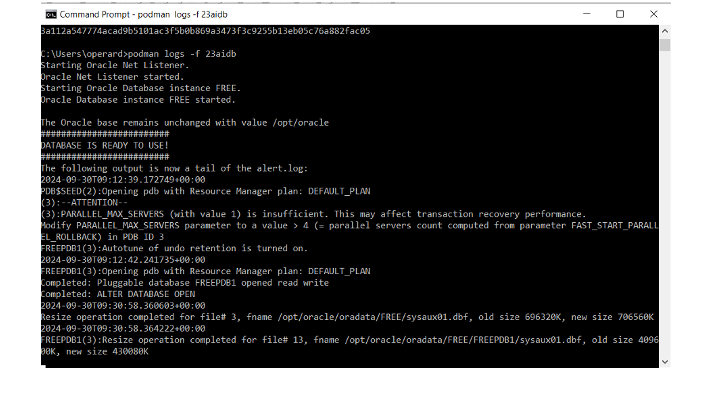

12. Check both containers

    After executing the BAT script, you could check in Podman Desktop the installation of the 2 containers:

    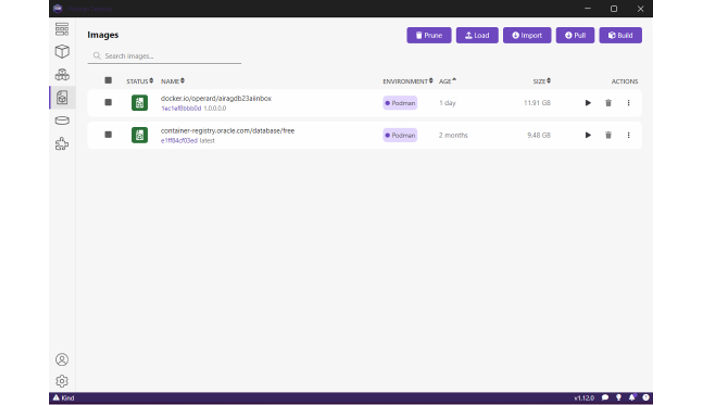

13. Check both containers: after executing the BAT script, you could check in Podman Desktop the installation of the 2 containers:

    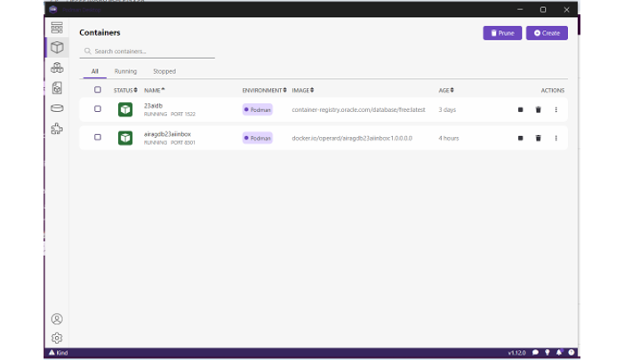

